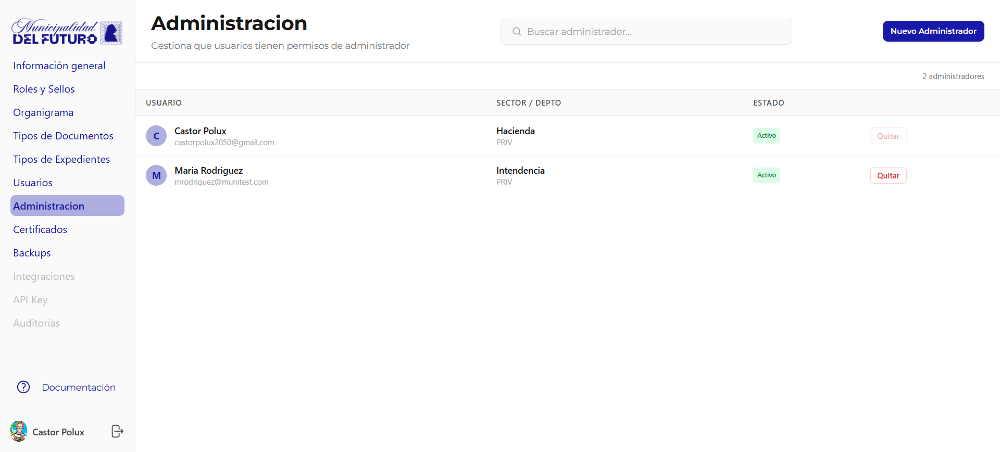

# Administracion

Gestiona que usuarios tienen permisos de administrador en el BackOffice. Los administradores pueden acceder a todas las secciones de configuracion de la organizacion.

---

## Listado de Administradores

La tabla muestra todos los usuarios con rol de administrador.

| Columna | Descripcion |
|---------|-------------|
| **Usuario** | Avatar con inicial, nombre completo y email |
| **Sector / Depto** | Departamento y sector del administrador |
| **Estado** | `Activo` o `Inactivo` |

### Acciones

| Accion | Descripcion |
|--------|-------------|
| **Buscar** | Filtrar administradores por nombre o email |
| **Nuevo Administrador** | Agregar un usuario existente como administrador |
| **Quitar** | Revocar permisos de administrador a un usuario |

!!! warning "Precaucion"
    Revocar permisos de administrador es una accion inmediata. El usuario perdera acceso al BackOffice en su proxima sesion. Asegurate de que siempre haya al menos un administrador activo.
