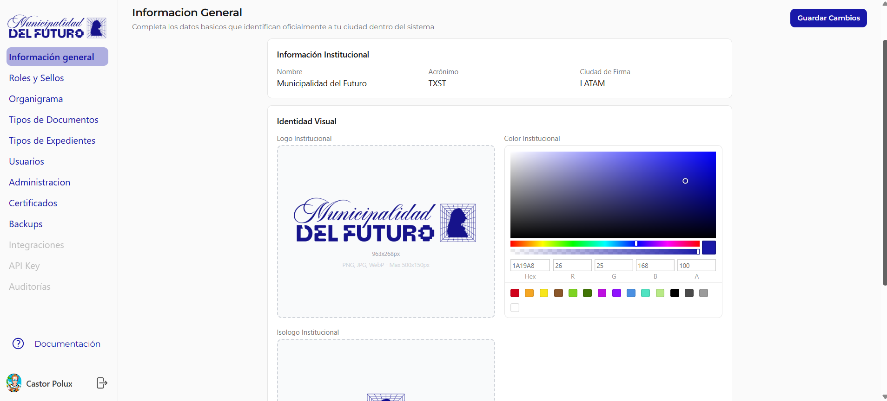

# Informacion General

Configura los datos basicos que identifican oficialmente a tu organizacion dentro del sistema.

---

## Informacion Institucional

Datos principales de la organizacion.

| Campo | Descripcion |
|-------|-------------|
| **Nombre** | Nombre completo de la organizacion (ej: *Municipalidad del Futuro*) |
| **Acronimo** | Sigla corta que identifica al tenant (ej: *TXST*). Se usa en la numeracion de documentos y expedientes |
| **Ciudad de Firma** | Ciudad que aparece en los sellos de firma digital (ej: *LATAM*) |

---

## Identidad Visual

Personalizacion grafica de la organizacion.

| Elemento | Descripcion | Especificaciones |
|----------|-------------|------------------|
| **Logo Institucional** | Imagen principal de la organizacion. Aparece en el sidebar y en los PDFs generados | PNG, JPG o WebP. Max 500x150px |
| **Color Institucional** | Color primario de la organizacion. Se aplica en la interfaz del BackOffice | Selector de color con valor Hex y RGBA |
| **Isologo Institucional** | Version compacta del logo para espacios reducidos | PNG, JPG o WebP. Max 500x150px |

---

## Acciones

| Accion | Descripcion |
|--------|-------------|
| **Guardar Cambios** | Guarda todas las modificaciones realizadas en la pagina |
