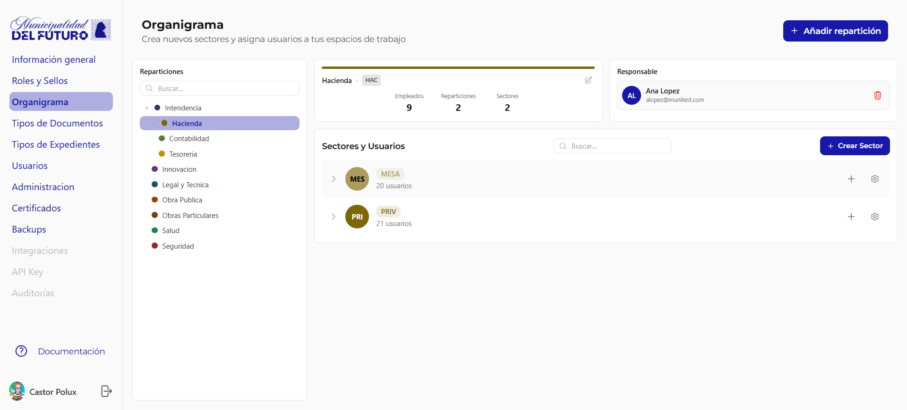
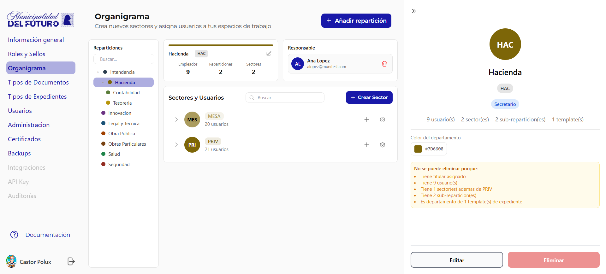
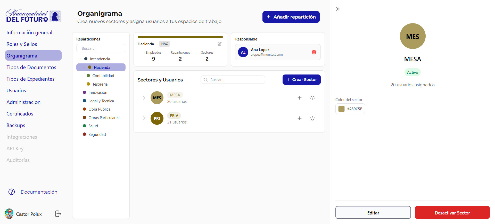
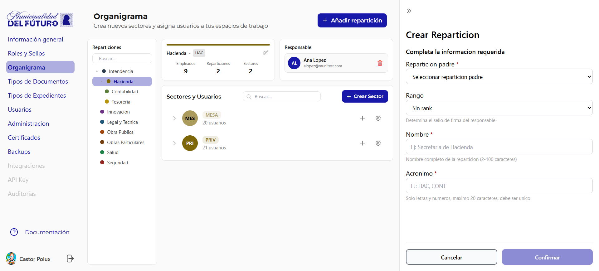
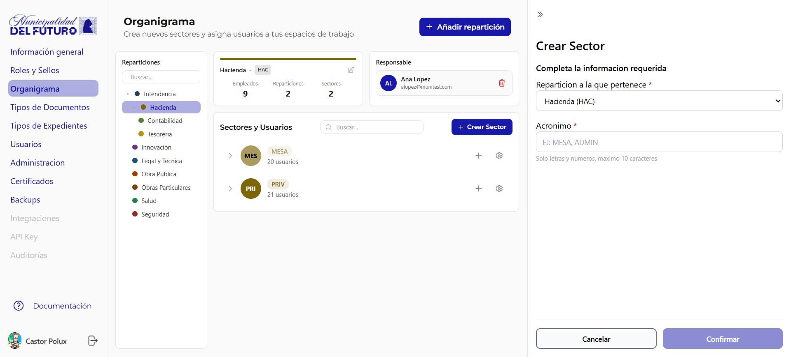

# Organigrama

Crea nuevos sectores y asigna usuarios a tus espacios de trabajo. El organigrama define la estructura organizativa del municipio: reparticiones (departamentos) y sectores.

---

## Panel de Reparticiones

El arbol de la izquierda muestra todas las reparticiones del municipio con su jerarquia y colores identificatorios.

- Cada reparticion tiene un **color** asignado y puede contener **sub-reparticiones**
- Al seleccionar una reparticion se muestra su detalle en el panel central

### Detalle de Reparticion

Al seleccionar una reparticion se muestran sus estadisticas:

| Dato | Descripcion |
|------|-------------|
| **Nombre** | Nombre completo de la reparticion (ej: *Hacienda*) |
| **Acronimo** | Sigla identificatoria (ej: *HAC*) |
| **Empleados** | Cantidad total de usuarios asignados |
| **Reparticiones** | Cantidad de sub-reparticiones |
| **Sectores** | Cantidad de sectores dentro de la reparticion |

---

## Responsable

Cada reparticion tiene un **responsable** asignado (titular del departamento).

| Campo | Descripcion |
|-------|-------------|
| **Nombre** | Nombre completo del responsable |
| **Email** | Correo electronico institucional |

---

## Sectores y Usuarios

Lista de sectores dentro de la reparticion seleccionada. Cada sector muestra:

| Dato | Descripcion |
|------|-------------|
| **Sigla** | Acronimo del sector (ej: *MES*, *PRI*) |
| **Nombre** | Nombre completo (ej: *MESA*, *PRIV*) |
| **Usuarios** | Cantidad de usuarios asignados |

### Detalle de Sector

Al hacer clic en el engranaje de un sector se abre el panel de detalle:

| Dato | Descripcion |
|------|-------------|
| **Nombre** | Nombre del sector |
| **Estado** | Activo / Inactivo |
| **Usuarios asignados** | Cantidad de usuarios en el sector |
| **Color del sector** | Color identificatorio (hex) |

---

## Crear Reparticion

Boton **+ Anadir reparticion** abre el panel lateral:

| Campo | Obligatorio | Descripcion |
|-------|:-----------:|-------------|
| **Reparticion padre** | Si | Reparticion a la que pertenece |
| **Rango** | No | Rango jerarquico del responsable |
| **Nombre** | Si | Nombre completo (2-100 caracteres) |
| **Acronimo** | Si | Solo letras y numeros, max 20 caracteres, unico |

---

## Crear Sector

Boton **+ Crear Sector** abre el panel lateral:

| Campo | Obligatorio | Descripcion |
|-------|:-----------:|-------------|
| **Reparticion a la que pertenece** | Si | Reparticion padre del sector |
| **Acronimo** | Si | Solo letras y numeros, max 10 caracteres |
