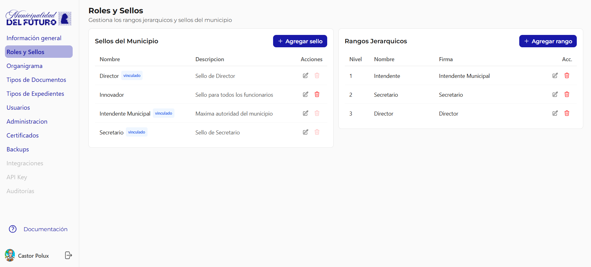

# Roles y Sellos

Gestiona los rangos jerarquicos y sellos de firma de la organizacion. Los rangos determinan que tipos de documentos puede firmar cada funcionario. Los sellos definen la firma visual que aparece en los PDFs.

---

## Como funciona la relacion entre Sellos y Rangos

El sistema tiene dos conceptos separados que trabajan juntos:

- **Sello**: La firma visual que se estampa en el PDF (nombre, cargo, formato).
- **Rango**: El nivel jerarquico del funcionario (Intendente, Secretario, Director).

Cada **Rango** tiene un **Sello** vinculado en la columna "Firma". Esta vinculacion es clave porque **el Rango puede pisar el sello individual del usuario**.

### Regla de prioridad de sello

Cada usuario tiene un **sello propio** asignado en su perfil (seccion [Usuarios](usuarios.md)). Sin embargo, si el usuario es **Responsable de Departamento** y su rango tiene un sello vinculado, el sistema aplica la siguiente logica:

1. El sistema verifica si el usuario tiene un **Rango** asignado como responsable de departamento
2. Si el Rango tiene un **Sello vinculado**, ese sello **pisa (sobreescribe)** el sello individual del usuario al momento de firmar
3. Si el usuario no tiene rango de responsable, se usa su **sello propio**

!!! example "Ejemplo practico"
    - **Ana Lopez** tiene asignado el sello *"Innovador"* en su perfil de usuario
    - Ana es **Responsable del departamento Hacienda** con rango de **Secretario** (Nivel 2)
    - El rango Secretario tiene vinculado el sello **"Secretario"**
    - Cuando Ana firma un documento, el sistema usa el sello **"Secretario"** (del rango), **no** el sello "Innovador" (de su perfil)

!!! warning "Importante"
    El sello que se ve en el perfil del usuario (seccion Firma/Sello) es el sello **propio** del usuario. No refleja necesariamente el sello que se usara al firmar, ya que el rango puede pisarlo.

---

## Sellos de la Organizacion

Cada sello define un tipo de firma visual que se estampa en los documentos firmados. Son las "plantillas" de firma disponibles en la organizacion.

| Campo | Descripcion |
|-------|-------------|
| **Nombre** | Nombre del sello (ej: *Director*, *Intendente Municipal*, *Secretario*, *Innovador*) |
| **Descripcion** | Texto descriptivo del sello |
| **Estado** | vinculado indica que el sello esta asociado a un **Rango Jerarquico** |

!!! info "Que significa vinculado"
    La etiqueta vinculado aparece cuando el sello esta asociado a un Rango en la tabla de Rangos Jerarquicos (columna "Firma"). Un sello solo puede estar vinculado a **un** Rango. Los sellos sin etiqueta "vinculado" (como *Innovador*) son sellos independientes que se asignan directamente a usuarios sin pasar por un rango.

### Acciones por sello

| Accion | Descripcion |
|--------|-------------|
| :material-pencil: **Editar** | Modificar nombre y descripcion del sello |
| :material-delete: **Eliminar** | Eliminar el sello. Solo posible si **no** esta vinculado a un Rango |
| **+ Agregar sello** | Crear un nuevo sello para la organizacion |

---

## Rangos Jerarquicos

Los rangos definen la jerarquia de la organizacion. Cada rango tiene un sello de firma vinculado y un nivel que determina que tipo de documentos puede numerar.

| Campo | Descripcion |
|-------|-------------|
| **Nivel** | Posicion en la jerarquia (1 = mas alto). Determina que tipos de documento puede numerar |
| **Nombre** | Nombre del rango (ej: *Intendente*, *Secretario*, *Director*) |
| **Firma** | Sello vinculado a este rango. Se usa al firmar en lugar del sello propio del usuario |

### Ejemplo de configuracion

| Nivel | Nombre | Firma (Sello vinculado) | Puede numerar |
|:-----:|--------|-------------------------|---------------|
| 1 | Intendente | Intendente Municipal | Decretos, Resoluciones, Disposiciones y todos los demas |
| 2 | Secretario | Secretario | Resoluciones, Disposiciones y tipos sin restriccion |
| 3 | Director | Director | Disposiciones y tipos sin restriccion |

!!! info "Relacion Rango - Tipo de Documento"
    Algunos tipos de documento requieren un rango minimo para poder ser numerados. Por ejemplo, un **Decreto** solo puede ser numerado por un funcionario con rango de **Intendente** (Nivel 1). Esta restriccion se configura en [Tipos de Documentos](tipos-de-documentos.md) > Restriccion por Rango.

### Acciones por rango

| Accion | Descripcion |
|--------|-------------|
| :material-pencil: **Editar** | Modificar nombre y sello de firma del rango |
| :material-delete: **Eliminar** | Eliminar el rango |
| **+ Agregar rango** | Crear un nuevo nivel jerarquico |
