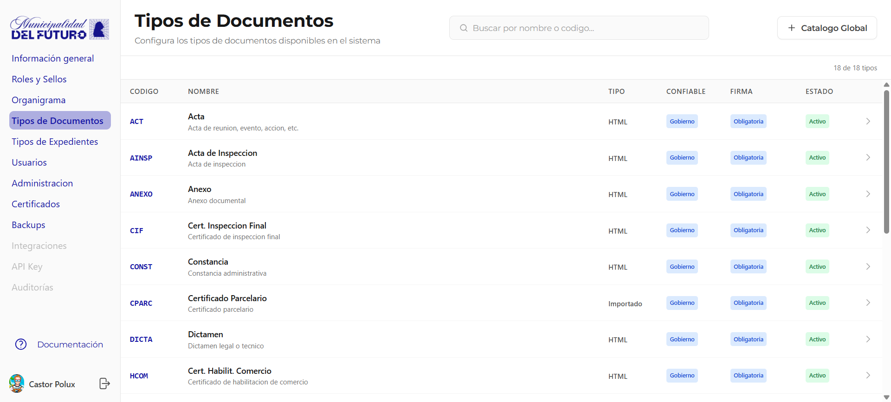
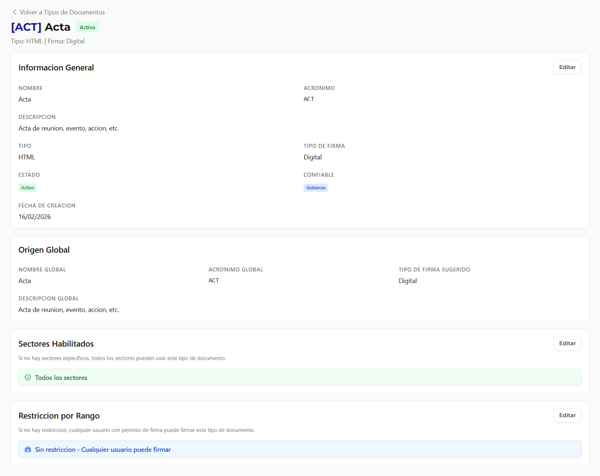
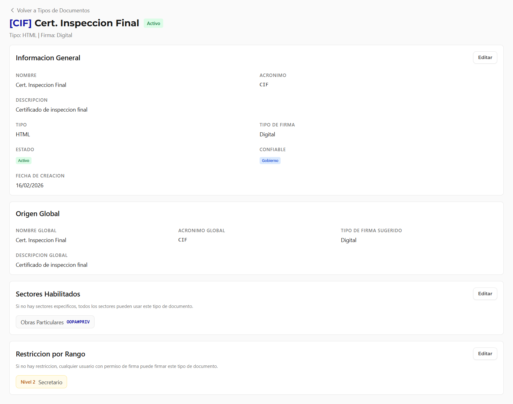
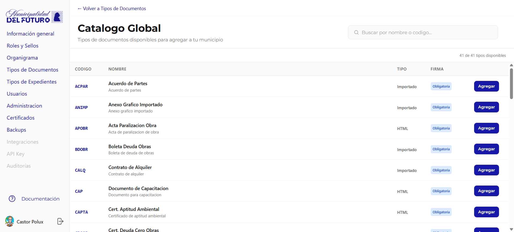

# Tipos de Documentos

Configura los tipos de documentos disponibles en el sistema. Cada organizacion selecciona del catalogo global los tipos que necesita y puede personalizar sus restricciones.

---

## Listado de Tipos

La tabla muestra todos los tipos de documento habilitados para la organizacion.

| Columna | Descripcion |
|---------|-------------|
| **Codigo** | Acronimo unico del tipo (ej: *ACT*, *AINSP*, *ANEXO*) |
| **Nombre** | Nombre completo del tipo y descripcion |
| **Tipo** | `HTML` (redactado en editor) o `Importado` (PDF cargado) |
| **Confiable** | Nivel de confiabilidad: `Gobierno` (documento oficial) |
| **Firma** | `Obligatoria` u `Opcional` |
| **Estado** | `Activo` o `Inactivo` |

---

## Detalle de un Tipo de Documento

Al hacer clic en un tipo se muestra su ficha completa:

### Informacion General

| Campo | Descripcion |
|-------|-------------|
| **Nombre** | Nombre del tipo |
| **Acronimo** | Codigo unico |
| **Descripcion** | Descripcion del proposito del tipo |
| **Tipo** | HTML o Importado |
| **Tipo de Firma** | Digital |
| **Estado** | Activo / Inactivo |
| **Confiable** | Gobierno |
| **Fecha de Creacion** | Fecha en que se agrego a la organizacion |

### Origen Global

Muestra los datos del tipo en el catalogo global (nombre, acronimo, descripcion y tipo de firma sugerido).

### Sectores Habilitados

Define que sectores pueden crear documentos de este tipo.

- **Todos los sectores**: Cualquier sector puede usar este tipo
- **Sectores especificos**: Solo los sectores listados pueden usarlo

### Restriccion por Rango

Define que rango minimo necesita un funcionario para **numerar** (firmar como numerador) documentos de este tipo.

- **Sin restriccion**: Cualquier usuario con permiso de firma puede firmar
- **Nivel N - Rango**: Solo funcionarios con ese rango o superior (ej: *Nivel 2 - Secretario*)

---

## Catalogo Global

Boton **+ Catalogo Global** muestra todos los tipos disponibles para agregar a la organizacion.

| Columna | Descripcion |
|---------|-------------|
| **Codigo** | Acronimo del tipo en el catalogo global |
| **Nombre** | Nombre y descripcion |
| **Tipo** | HTML o Importado |
| **Firma** | Obligatoria u Opcional |
| **Agregar** | Boton para habilitar el tipo en la organizacion |
