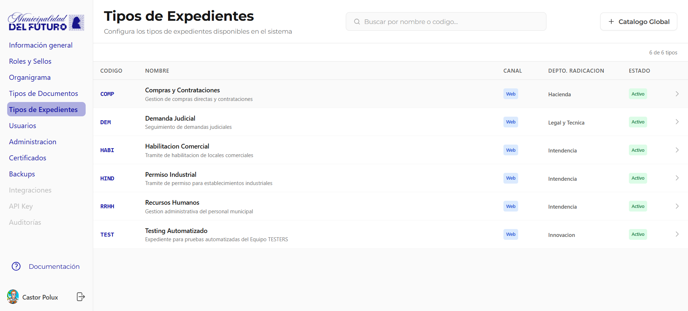
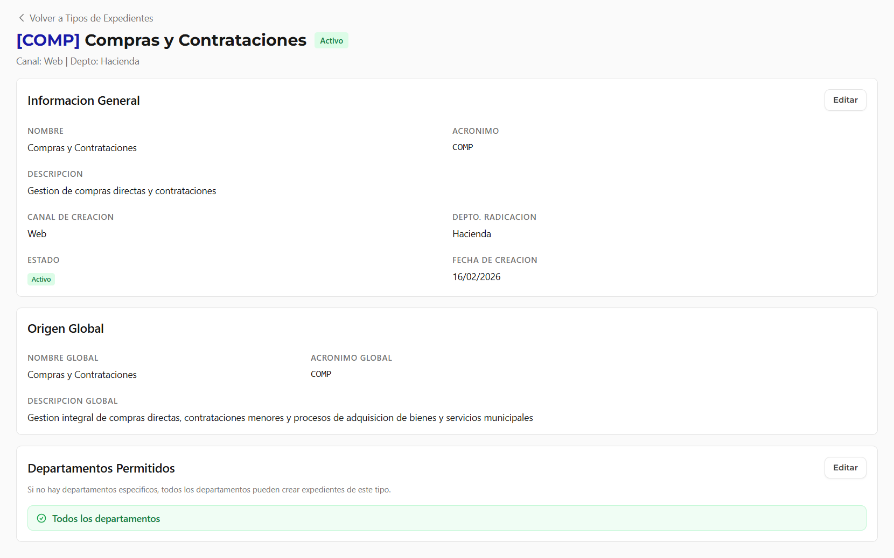
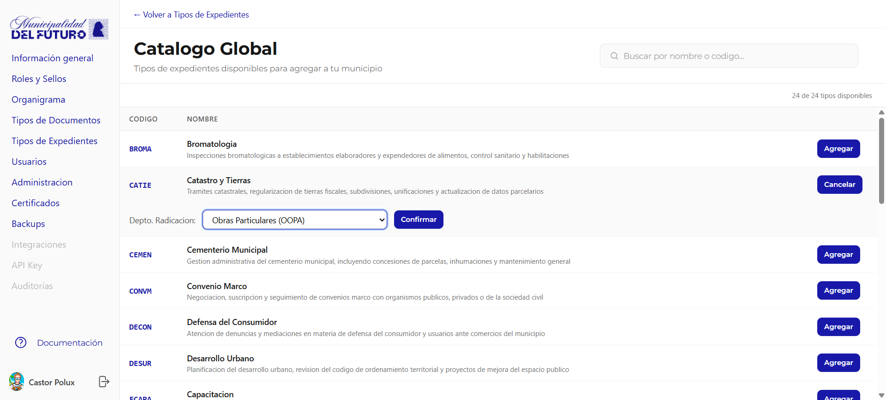

# Tipos de Expedientes

Configura los tipos de expedientes disponibles en el sistema. Cada municipio selecciona del catalogo global los tipos de expediente que necesita.

---

## Listado de Tipos

La tabla muestra todos los tipos de expediente habilitados para el municipio.

| Columna | Descripcion |
|---------|-------------|
| **Codigo** | Acronimo unico del tipo (ej: *COMP*, *DEM*, *HABI*) |
| **Nombre** | Nombre completo y descripcion |
| **Canal** | Canal de creacion: `Web` (desde la aplicacion) |
| **Depto. Radicacion** | Departamento responsable de radicar expedientes de este tipo |
| **Estado** | `Activo` o `Inactivo` |

---

## Detalle de un Tipo de Expediente

Al hacer clic en un tipo se muestra su ficha completa:

### Informacion General

| Campo | Descripcion |
|-------|-------------|
| **Nombre** | Nombre del tipo de expediente |
| **Acronimo** | Codigo unico |
| **Descripcion** | Descripcion del proposito |
| **Canal de Creacion** | Web |
| **Depto. Radicacion** | Departamento donde se radican los expedientes |
| **Estado** | Activo / Inactivo |
| **Fecha de Creacion** | Fecha en que se agrego al municipio |

### Origen Global

Muestra los datos del tipo en el catalogo global (nombre, acronimo y descripcion global).

### Departamentos Permitidos

Define que departamentos pueden crear expedientes de este tipo.

- **Todos los departamentos**: Cualquier departamento puede crear expedientes de este tipo
- **Departamentos especificos**: Solo los departamentos listados

---

## Catalogo Global

Boton **+ Catalogo Global** muestra todos los tipos de expediente disponibles para agregar.

| Columna | Descripcion |
|---------|-------------|
| **Codigo** | Acronimo del tipo en el catalogo global |
| **Nombre** | Nombre y descripcion |
| **Agregar** | Boton para habilitar el tipo en el municipio |

!!! info "Departamento de Radicacion"
    Al agregar un tipo de expediente desde el catalogo global, el sistema solicita seleccionar el **Departamento de Radicacion** antes de confirmar. Este departamento sera donde se radiquen los expedientes de este tipo.
