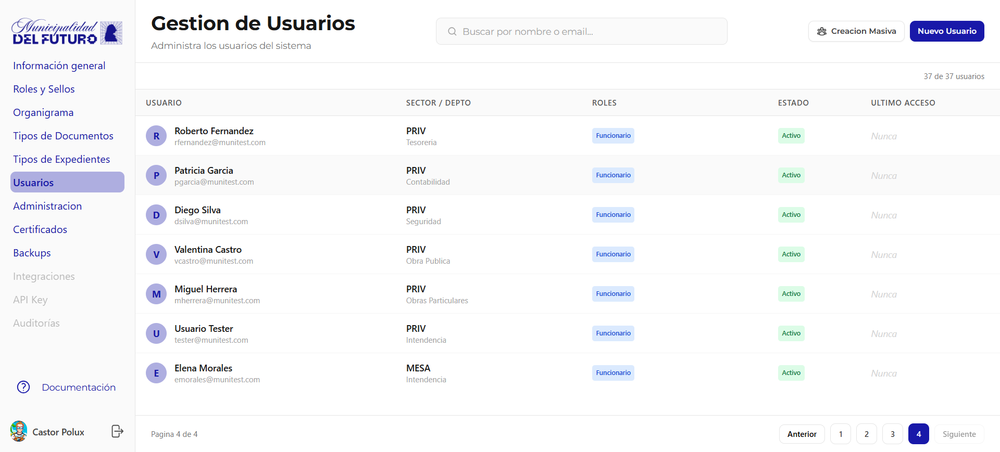
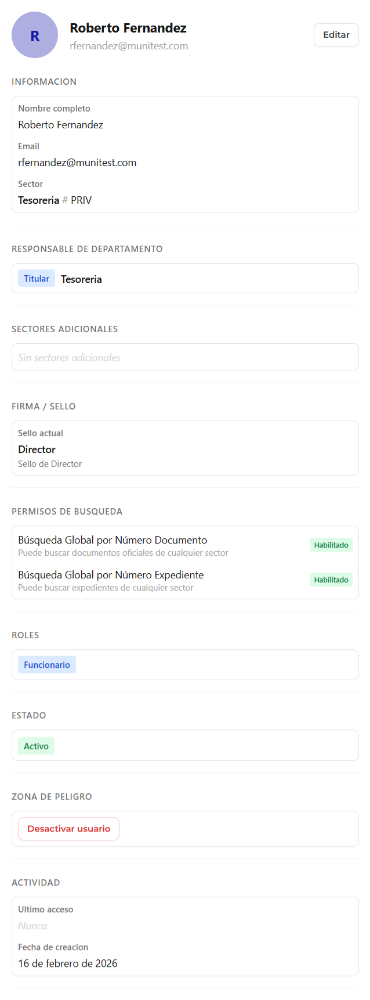

# Gestion de Usuarios

Administra los usuarios del sistema: crear, editar, asignar sectores, roles, sellos y permisos.

---

## Listado de Usuarios

La tabla muestra todos los usuarios de la organizacion con paginacion.

| Columna | Descripcion |
|---------|-------------|
| **Usuario** | Avatar con inicial, nombre completo y email |
| **Sector / Depto** | Sector principal y departamento al que pertenece |
| **Roles** | Rol asignado: `Funcionario`, `Administrador` |
| **Estado** | `Activo` o `Inactivo` |
| **Ultimo Acceso** | Fecha del ultimo login (*Nunca* si no ha ingresado) |

### Acciones del listado

| Accion | Descripcion |
|--------|-------------|
| **Buscar** | Filtrar por nombre o email |
| **Creacion Masiva** | Crear multiples usuarios a la vez |
| **Nuevo Usuario** | Crear un usuario individual |

---

## Detalle de Usuario

Al hacer clic en un usuario se muestra su ficha completa:

### Informacion

| Campo | Descripcion |
|-------|-------------|
| **Nombre completo** | Nombre y apellido del usuario |
| **Email** | Correo electronico institucional |
| **Sector** | Sector principal asignado (ej: *Tesoreria # PRIV*) |

### Responsable de Departamento

Si el usuario es titular de un departamento, se muestra aqui.

| Campo | Descripcion |
|-------|-------------|
| **Titular** | Indica que el usuario es responsable del departamento |
| **Departamento** | Nombre del departamento (ej: *Tesoreria*) |

### Sectores Adicionales

Lista de sectores adicionales a los que el usuario tiene acceso, ademas de su sector principal.

### Firma / Sello

| Campo | Descripcion |
|-------|-------------|
| **Sello actual** | Nombre y descripcion del sello de firma asignado (ej: *Director - Sello de Director*) |

### Permisos de Busqueda

| Permiso | Descripcion |
|---------|-------------|
| **Busqueda Global por Numero Documento** | Puede buscar documentos oficiales de cualquier sector |
| **Busqueda Global por Numero Expediente** | Puede buscar expedientes de cualquier sector |

### Roles

Roles asignados al usuario: `Funcionario`, `Administrador`.

### Estado

Estado actual del usuario: `Activo` o `Inactivo`.

### Zona de Peligro

| Accion | Descripcion |
|--------|-------------|
| **Desactivar usuario** | Desactiva el acceso del usuario al sistema. El usuario no podra iniciar sesion |

### Actividad

| Campo | Descripcion |
|-------|-------------|
| **Ultimo acceso** | Fecha y hora del ultimo login |
| **Fecha de creacion** | Fecha en que se creo el usuario en el sistema |
