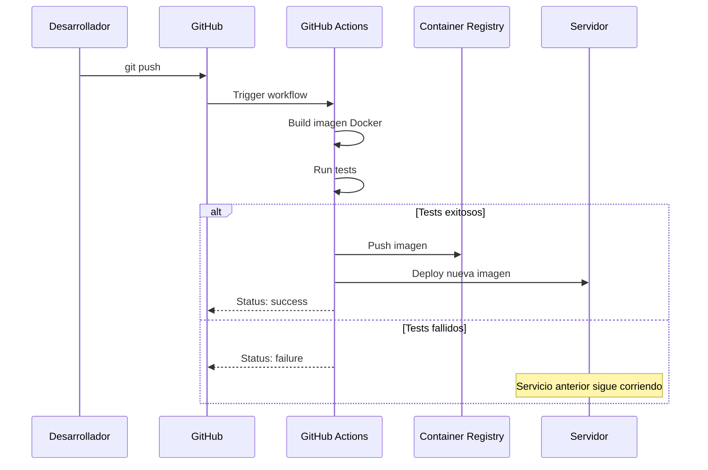
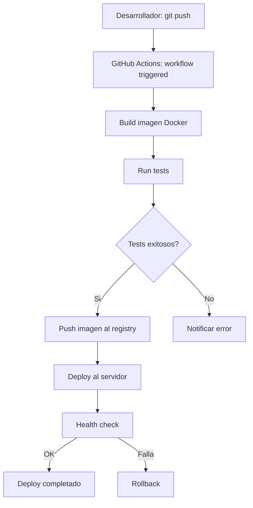

# GitHub Actions

## Vision General

GDI Latam usa GitHub como plataforma de repositorios. El CI/CD se implementa con GitHub Actions para construir imagenes Docker y publicarlas en un container registry.

---

## Repositorios

Cada servicio es un repositorio independiente en la organizacion GitHub:

| Repositorio | Servicio | Stack |
|-------------|----------|-------|
| GDI-FRONTEND | GDI-FRONTEND | Next.js 15 |
| GDI-Backend | GDI-Backend | FastAPI |
| GDI-BackOffice-Front | GDI-BackOffice-Front | Next.js 15 |
| GDI-BackOffice-Back | GDI-BackOffice-Back | FastAPI |
| GDI-PDFComposer | GDI-PDFComposer | FastAPI |
| GDI-Notary | GDI-Notary | FastAPI + pyHanko |
| GDI-AgenteLANG | GDI-AgenteLANG | FastAPI + LangGraph |
| GDI-BD | -- | Scripts SQL, migraciones |

---

## Workflow de CI/CD

### Como Funciona

1. Desarrollador hace `git push` a la rama principal
2. GitHub Actions ejecuta el workflow
3. Se construye la imagen Docker del servicio
4. Se ejecutan tests (si aplica)
5. Se publica la imagen en el container registry
6. Se despliega la nueva imagen en el servidor



---

## Workflow de Ejemplo

### Build y Push a GitHub Container Registry

```yaml
# .github/workflows/deploy.yml
name: Build and Deploy

on:
  push:
    branches: [main]

env:
  REGISTRY: ghcr.io
  IMAGE_NAME: ${{ github.repository }}

jobs:
  test:
    runs-on: ubuntu-latest
    steps:
      - uses: actions/checkout@v4

      - name: Set up Python
        uses: actions/setup-python@v5
        with:
          python-version: "3.12"

      - name: Install dependencies
        run: pip install -r requirements.txt

      - name: Run tests
        run: pytest tests/ -v

  build-and-push:
    needs: test
    runs-on: ubuntu-latest
    permissions:
      contents: read
      packages: write
    steps:
      - uses: actions/checkout@v4

      - name: Log in to Container Registry
        uses: docker/login-action@v3
        with:
          registry: ${{ env.REGISTRY }}
          username: ${{ github.actor }}
          password: ${{ secrets.GITHUB_TOKEN }}

      - name: Extract metadata
        id: meta
        uses: docker/metadata-action@v5
        with:
          images: ${{ env.REGISTRY }}/${{ env.IMAGE_NAME }}
          tags: |
            type=sha,prefix=
            type=raw,value=latest

      - name: Build and push Docker image
        uses: docker/build-push-action@v5
        with:
          context: .
          push: true
          tags: ${{ steps.meta.outputs.tags }}
          labels: ${{ steps.meta.outputs.labels }}
```

### Workflow para Servicios Next.js

```yaml
# .github/workflows/deploy.yml
name: Build and Deploy Frontend

on:
  push:
    branches: [main]

env:
  REGISTRY: ghcr.io
  IMAGE_NAME: ${{ github.repository }}

jobs:
  build-and-push:
    runs-on: ubuntu-latest
    permissions:
      contents: read
      packages: write
    steps:
      - uses: actions/checkout@v4

      - name: Log in to Container Registry
        uses: docker/login-action@v3
        with:
          registry: ${{ env.REGISTRY }}
          username: ${{ github.actor }}
          password: ${{ secrets.GITHUB_TOKEN }}

      - name: Build and push
        uses: docker/build-push-action@v5
        with:
          context: .
          push: true
          tags: ${{ env.REGISTRY }}/${{ env.IMAGE_NAME }}:latest
```

---

## GitHub Secrets

Los siguientes secrets se configuran en cada repositorio (o a nivel de organizacion):

| Secret | Descripcion | Donde obtener |
|--------|-------------|---------------|
| `GITHUB_TOKEN` | Token automatico de GitHub | Disponible por defecto en Actions |
| `DEPLOY_HOST` | IP o hostname del servidor | Administrador de infraestructura |
| `DEPLOY_KEY` | SSH key para deploy al servidor | `ssh-keygen` en el servidor |

### Configurar Secrets

**A nivel de repositorio:**

1. Ir al repositorio en GitHub
2. **Settings** > **Secrets and variables** > **Actions**
3. Click **New repository secret**

**A nivel de organizacion (recomendado):**

1. Ir a la organizacion en GitHub
2. **Settings** > **Secrets and variables** > **Actions**
3. Agregar secrets compartidos
4. Seleccionar repositorios que pueden acceder

---

## Servicios con Dockerfile

Todos los servicios backend tienen su propio `Dockerfile`:

| Servicio | Base Image | Notas |
|----------|-----------|-------|
| GDI-Backend | `python:3.12-slim` | Gunicorn + Uvicorn, multi-worker |
| GDI-BackOffice-Back | `python:3.12-slim` | psycopg2 |
| GDI-PDFComposer | `python:3.11-slim` | Usuario non-root, gunicorn config |
| GDI-Notary | `python:3.11-slim` | Dependencias sistema (wget, fontconfig), fuentes, certificados |
| GDI-AgenteLANG | `python:3.11-slim` | Dependencias sistema (gcc, libpq-dev) |

### Servicios Next.js (Node)

Los frontends tambien se pueden construir como imagen Docker:

```dockerfile
# Dockerfile para Next.js
FROM node:20-slim AS builder
WORKDIR /app
COPY package*.json ./
RUN npm ci
COPY . .
RUN npm run build

FROM node:20-slim
WORKDIR /app
COPY --from=builder /app/.next ./.next
COPY --from=builder /app/node_modules ./node_modules
COPY --from=builder /app/package.json ./
EXPOSE 3000
CMD ["npm", "start"]
```

---

## Flujo Completo de un Deployment



---

## Buenas Practicas

### Branching

```bash
# Crear rama de feature
git checkout -b feat/nueva-funcionalidad

# Desarrollar y commitear
git add .
git commit -m "feat(backend): add new endpoint for X"

# Push a feature branch (NO despliega)
git push origin feat/nueva-funcionalidad

# Crear Pull Request en GitHub
# Review + merge a main = Deploy automatico
```

!!! tip "Proteccion de rama main"
    Se recomienda configurar proteccion de rama en `main` para requerir Pull Request con al menos 1 review antes de merge. Esto evita deployments accidentales.

### Commits

Seguir el formato convencional por repositorio:

```bash
# Formato
<tipo>(<scope>): <descripcion>

# Ejemplos
feat(backend): add document import endpoint
fix(frontend): resolve PDF viewer hydration error
refactor(notary): extract certificate loading logic
docs(deploy): update Docker configuration guide
```

### Pre-deploy Checklist

- [ ] Tests pasando localmente
- [ ] Variables de entorno actualizadas en el servidor
- [ ] Health check del servicio funciona
- [ ] Sin credenciales hardcodeadas en el codigo
- [ ] PR revisado y aprobado
- [ ] Base de datos migrada si hay cambios de schema

### Post-deploy Checklist

- [ ] Logs sin errores criticos (`docker compose logs -f <servicio>`)
- [ ] Health check respondiendo 200
- [ ] Funcionalidad principal testeada
- [ ] Servicios dependientes funcionando
