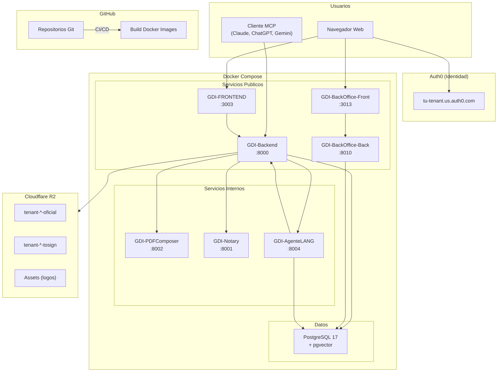

# Infraestructura

## Vision General

GDI Latam opera sobre una arquitectura cloud distribuida en tres plataformas principales:

| Plataforma | Rol | Servicios |
|------------|-----|-----------|
| **Docker** | Hosting de aplicaciones y base de datos | 7+ servicios (backends, frontends, microservicios, PostgreSQL) |
| **Cloudflare R2** | Almacenamiento de objetos (S3-compatible) | Buckets para PDFs oficiales, PDFs pendientes de firma, assets |
| **Auth0** | Identidad y autenticacion | OAuth 2.0, JWT, SSO para todas las aplicaciones |

---

## Diagrama de Infraestructura



---

## Servicios Desplegados

### Servicios Publicos (con URL externa)

| Servicio | Stack | Puerto | Proposito |
|----------|-------|--------|-----------|
| GDI-FRONTEND | Next.js 15, React 18, TypeScript | 3003 | Portal ciudadano y funcionarios |
| GDI-Backend | FastAPI, Python 3.12, Gunicorn | 8000 | API REST principal + MCP Server |
| GDI-BackOffice-Front | Next.js 15, React 18, TypeScript | 3013 | Panel de administracion |
| GDI-BackOffice-Back | FastAPI, Python 3.12, psycopg2 | 8010 | API REST BackOffice |

### Servicios Internos (solo accesibles dentro de la red Docker)

| Servicio | Stack | Puerto | Proposito |
|----------|-------|--------|-----------|
| GDI-PDFComposer | FastAPI, Jinja2, WeasyPrint, PyMuPDF | 8002 | Generacion de PDFs (preview, final, caratulas, pases) |
| GDI-Notary | FastAPI, pyHanko, PyMuPDF | 8001 | Firma digital PAdES y visual de PDFs |
| GDI-AgenteLANG | FastAPI, LangGraph, pgvector | 8004 | Agente IA con RAG |

### Base de Datos

| Servicio | Version | Tipo | Proposito |
|----------|---------|------|-----------|
| PostgreSQL | 17+ | Docker (pgvector/pgvector:pg17) | BD principal con pgvector para embeddings |

---

## Flujo de Comunicacion

### Comunicacion Externa (URLs publicas)

Los frontends y clientes MCP se comunican con los backends a traves de URLs publicas configuradas con un reverse proxy o dominio:

```
Browser → https://tu-frontend.tu-dominio.com → https://tu-backend.tu-dominio.com
```

### Comunicacion Interna (Docker Networking)

Los backends se comunican con los microservicios a traves de la red interna de Docker Compose, usando el nombre del servicio como hostname:

```
GDI-Backend → http://pdfcomposer:8002
GDI-Backend → http://notary:8001
GDI-Backend → http://agentelang:8004
```

!!! warning "Docker Networking"
    Las URLs internas (ej: `http://pdfcomposer:8002`) solo funcionan entre servicios de la misma red Docker Compose. No son accesibles desde internet ni desde maquinas fuera del host.

---

## Seguridad

### Autenticacion

| Capa | Mecanismo | Proveedor |
|------|-----------|-----------|
| Usuarios finales | OAuth 2.0 + JWT | Auth0 |
| Comunicacion entre servicios | API Key (`X-API-Key` header) | Configurado en variables de entorno |
| MCP Server | OAuth 2.0 (RFC 9728) | Auth0 |
| REST API externa | API Key + `X-User-ID` | Almacenado en BD |

### Variables Sensibles

Todas las credenciales se almacenan como variables de entorno (archivos `.env` o seccion `environment:` en Docker Compose). Nunca en codigo fuente.

| Tipo | Ejemplos |
|------|----------|
| Base de datos | `DATABASE_URL`, `DB_HOST`, `DB_PASSWORD` |
| Auth0 | `AUTH0_DOMAIN`, `AUTH0_CLIENT_SECRET` |
| Cloudflare R2 | `CF_R2_ACCESS_KEY_ID`, `CF_R2_SECRET_ACCESS_KEY` |
| API Keys internas | `PDFCOMPOSER_API_KEY`, `NOTARY_API_KEY` |

---

## Secciones de esta Guia

| Seccion | Contenido |
|---------|-----------|
| [Docker](railway.md) | Servicios, Docker Compose, networking, health checks |
| [Cloudflare R2](cloudflare-r2.md) | Buckets, credenciales, API S3, estructura de keys |
| [GitHub Actions](github-actions.md) | Workflows CI/CD, build de imagenes Docker |
