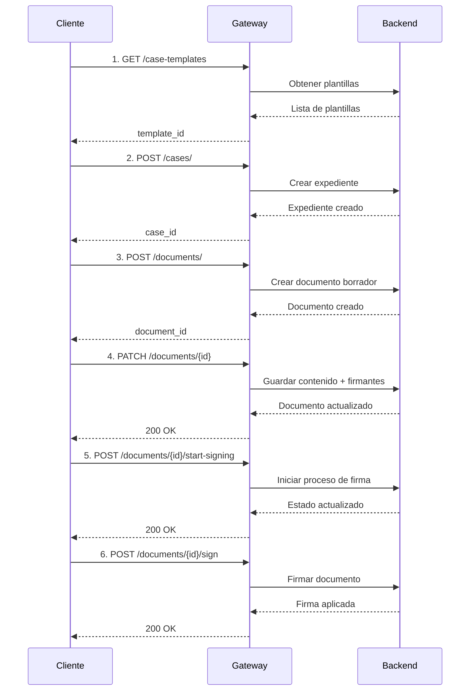
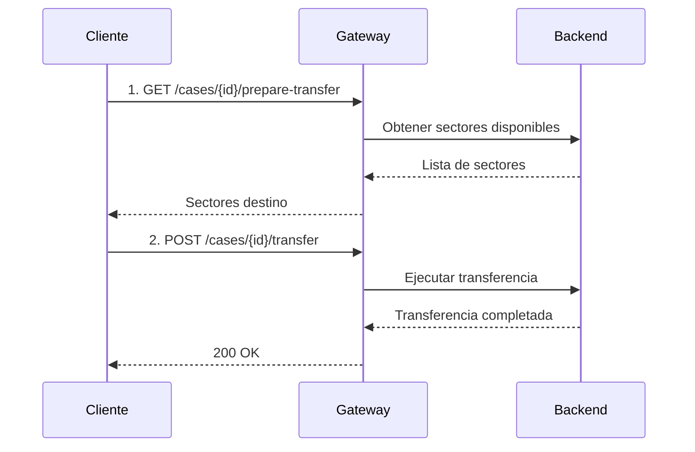
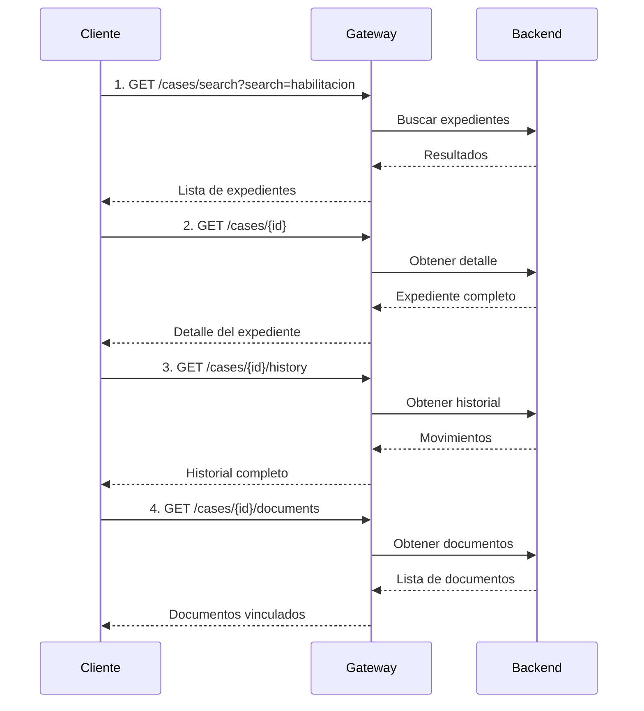
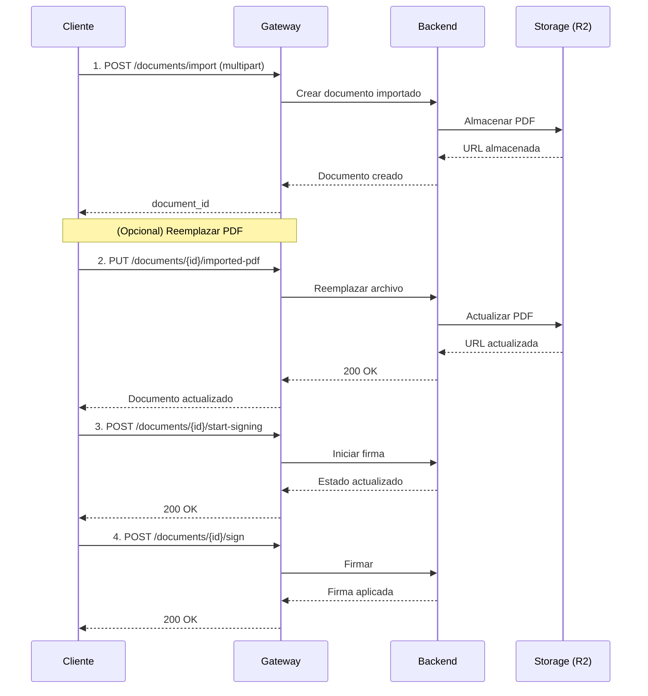
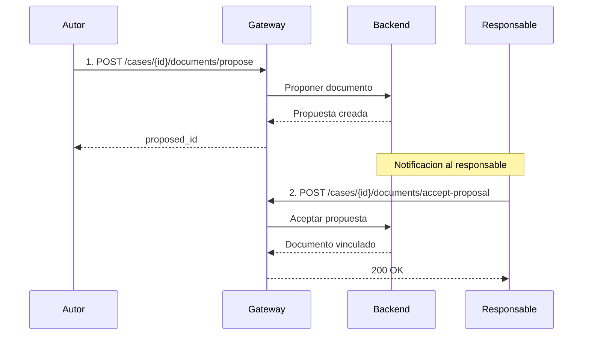

# Flujos Completos

Esta pagina documenta los flujos de trabajo mas comunes del Gateway, mostrando la secuencia completa de llamadas API necesarias para cada operacion.

## Configuracion base

**Base URL:**

```
https://gateway.tu-municipio.gdilatam.com
```

**Headers requeridos en todas las llamadas:**

| Header | Descripcion |
|--------|------------|
| `X-API-Key` | Clave de API proporcionada por el administrador |
| `X-User-ID` | UUID del usuario que realiza la operacion |

---

## Flujo 1: Crear expediente con documento y firma

Flujo completo desde la creacion de un expediente hasta la firma del documento vinculado.



### Paso 1: Obtener plantillas de expediente

```bash
curl -X GET "https://gateway.tu-municipio.gdilatam.com/api/v1/system/case-templates" \
  -H "X-API-Key: tu-api-key" \
  -H "X-User-ID: uuid-del-usuario"
```

**Respuesta (200):**

```json
{
  "case_templates": [
    {
      "id": "a1b2c3d4-e5f6-7890-abcd-ef1234567890",
      "name": "Expediente de Habilitacion",
      "description": "Tramite de habilitacion comercial"
    },
    {
      "id": "b2c3d4e5-f6a7-8901-bcde-f12345678901",
      "name": "Expediente Administrativo",
      "description": "Expediente administrativo general"
    }
  ]
}
```

### Paso 2: Crear expediente

```bash
curl -X POST "https://gateway.tu-municipio.gdilatam.com/api/v1/cases/" \
  -H "X-API-Key: tu-api-key" \
  -H "X-User-ID: uuid-del-usuario" \
  -H "Content-Type: application/json" \
  -d '{
    "case_template_id": "a1b2c3d4-e5f6-7890-abcd-ef1234567890",
    "reference": "Habilitacion comercial - Local Av. Rivadavia 1234"
  }'
```

**Respuesta (201):**

```json
{
  "case_id": "c3d4e5f6-a7b8-9012-cdef-123456789012",
  "case_number": "EXP-2026-000142",
  "reference": "Habilitacion comercial - Local Av. Rivadavia 1234",
  "status": "open",
  "created_at": "2026-03-03T10:30:00Z"
}
```

### Paso 3: Crear documento borrador

```bash
curl -X POST "https://gateway.tu-municipio.gdilatam.com/api/v1/documents/" \
  -H "X-API-Key: tu-api-key" \
  -H "X-User-ID: uuid-del-usuario" \
  -H "Content-Type: application/json" \
  -d '{
    "document_type_acronym": "INF",
    "reference": "Informe tecnico de habilitacion",
    "case_id": "c3d4e5f6-a7b8-9012-cdef-123456789012"
  }'
```

**Respuesta (201):**

```json
{
  "document_id": "d4e5f6a7-b8c9-0123-defa-234567890123",
  "document_number": "INF-2026-000089",
  "document_type": "INF",
  "reference": "Informe tecnico de habilitacion",
  "state": "draft",
  "case_id": "c3d4e5f6-a7b8-9012-cdef-123456789012",
  "created_at": "2026-03-03T10:31:00Z"
}
```

### Paso 4: Guardar contenido y firmantes

```bash
curl -X PATCH "https://gateway.tu-municipio.gdilatam.com/api/v1/documents/d4e5f6a7-b8c9-0123-defa-234567890123" \
  -H "X-API-Key: tu-api-key" \
  -H "X-User-ID: uuid-del-usuario" \
  -H "Content-Type: application/json" \
  -d '{
    "content": "<p>Se informa que el local ubicado en Av. Rivadavia 1234 cumple con los requisitos tecnicos para habilitacion comercial.</p>",
    "signers": [
      {
        "user_id": "e5f6a7b8-c9d0-1234-efab-345678901234",
        "order": 1
      }
    ]
  }'
```

**Respuesta (200):**

```json
{
  "document_id": "d4e5f6a7-b8c9-0123-defa-234567890123",
  "state": "draft",
  "content": "<p>Se informa que el local ubicado en Av. Rivadavia 1234 cumple con los requisitos tecnicos para habilitacion comercial.</p>",
  "signers": [
    {
      "user_id": "e5f6a7b8-c9d0-1234-efab-345678901234",
      "order": 1,
      "signed": false
    }
  ]
}
```

### Paso 5: Iniciar firma

```bash
curl -X POST "https://gateway.tu-municipio.gdilatam.com/api/v1/documents/d4e5f6a7-b8c9-0123-defa-234567890123/start-signing" \
  -H "X-API-Key: tu-api-key" \
  -H "X-User-ID: uuid-del-usuario"
```

**Respuesta (200):**

```json
{
  "document_id": "d4e5f6a7-b8c9-0123-defa-234567890123",
  "state": "sent_to_sign",
  "message": "Documento enviado a firma"
}
```

### Paso 6: Firmar documento

Cada firmante ejecuta esta llamada con su propio `X-User-ID`.

```bash
curl -X POST "https://gateway.tu-municipio.gdilatam.com/api/v1/documents/d4e5f6a7-b8c9-0123-defa-234567890123/sign" \
  -H "X-API-Key: tu-api-key" \
  -H "X-User-ID: e5f6a7b8-c9d0-1234-efab-345678901234"
```

**Respuesta (200):**

```json
{
  "document_id": "d4e5f6a7-b8c9-0123-defa-234567890123",
  "state": "signed",
  "message": "Documento firmado exitosamente"
}
```

---

## Flujo 2: Transferir expediente

Transferir un expediente de un sector a otro dentro del municipio.



### Paso 1: Obtener sectores disponibles

```bash
curl -X GET "https://gateway.tu-municipio.gdilatam.com/api/v1/cases/c3d4e5f6-a7b8-9012-cdef-123456789012/prepare-transfer" \
  -H "X-API-Key: tu-api-key" \
  -H "X-User-ID: uuid-del-usuario"
```

**Respuesta (200):**

```json
{
  "available_sectors": [
    {
      "sector_id": "f6a7b8c9-d0e1-2345-fab0-456789012345",
      "name": "Direccion de Obras Particulares",
      "department": "Secretaria de Obras Publicas"
    },
    {
      "sector_id": "a7b8c9d0-e1f2-3456-ab01-567890123456",
      "name": "Direccion de Habilitaciones",
      "department": "Secretaria de Gobierno"
    }
  ]
}
```

### Paso 2: Transferir expediente

```bash
curl -X POST "https://gateway.tu-municipio.gdilatam.com/api/v1/cases/c3d4e5f6-a7b8-9012-cdef-123456789012/transfer" \
  -H "X-API-Key: tu-api-key" \
  -H "X-User-ID: uuid-del-usuario" \
  -H "Content-Type: application/json" \
  -d '{
    "target_sector_id": "f6a7b8c9-d0e1-2345-fab0-456789012345",
    "reason": "Requiere revision tecnica de obras particulares"
  }'
```

**Respuesta (200):**

```json
{
  "case_id": "c3d4e5f6-a7b8-9012-cdef-123456789012",
  "message": "Expediente transferido exitosamente",
  "target_sector": "Direccion de Obras Particulares"
}
```

---

## Flujo 3: Buscar y consultar

Buscar expedientes y consultar su informacion completa.



### Paso 1: Buscar expedientes

```bash
curl -X GET "https://gateway.tu-municipio.gdilatam.com/api/v1/cases/search?search=habilitacion" \
  -H "X-API-Key: tu-api-key" \
  -H "X-User-ID: uuid-del-usuario"
```

**Respuesta (200):**

```json
{
  "results": [
    {
      "case_id": "c3d4e5f6-a7b8-9012-cdef-123456789012",
      "case_number": "EXP-2026-000142",
      "reference": "Habilitacion comercial - Local Av. Rivadavia 1234",
      "status": "open",
      "current_sector": "Direccion de Habilitaciones",
      "created_at": "2026-03-03T10:30:00Z"
    }
  ],
  "total": 1
}
```

### Paso 2: Obtener detalle del expediente

```bash
curl -X GET "https://gateway.tu-municipio.gdilatam.com/api/v1/cases/c3d4e5f6-a7b8-9012-cdef-123456789012" \
  -H "X-API-Key: tu-api-key" \
  -H "X-User-ID: uuid-del-usuario"
```

**Respuesta (200):**

```json
{
  "case_id": "c3d4e5f6-a7b8-9012-cdef-123456789012",
  "case_number": "EXP-2026-000142",
  "reference": "Habilitacion comercial - Local Av. Rivadavia 1234",
  "status": "open",
  "current_sector": "Direccion de Habilitaciones",
  "assigned_to": {
    "user_id": "uuid-del-usuario",
    "name": "Juan Perez"
  },
  "created_at": "2026-03-03T10:30:00Z",
  "updated_at": "2026-03-03T10:35:00Z"
}
```

### Paso 3: Obtener historial

```bash
curl -X GET "https://gateway.tu-municipio.gdilatam.com/api/v1/cases/c3d4e5f6-a7b8-9012-cdef-123456789012/history" \
  -H "X-API-Key: tu-api-key" \
  -H "X-User-ID: uuid-del-usuario"
```

**Respuesta (200):**

```json
{
  "history": [
    {
      "action": "created",
      "timestamp": "2026-03-03T10:30:00Z",
      "user": "Juan Perez",
      "details": "Expediente creado"
    },
    {
      "action": "document_added",
      "timestamp": "2026-03-03T10:31:00Z",
      "user": "Juan Perez",
      "details": "Documento INF-2026-000089 vinculado"
    }
  ]
}
```

### Paso 4: Obtener documentos vinculados

```bash
curl -X GET "https://gateway.tu-municipio.gdilatam.com/api/v1/cases/c3d4e5f6-a7b8-9012-cdef-123456789012/documents" \
  -H "X-API-Key: tu-api-key" \
  -H "X-User-ID: uuid-del-usuario"
```

**Respuesta (200):**

```json
{
  "documents": [
    {
      "document_id": "d4e5f6a7-b8c9-0123-defa-234567890123",
      "document_number": "INF-2026-000089",
      "document_type": "INF",
      "reference": "Informe tecnico de habilitacion",
      "state": "signed",
      "created_at": "2026-03-03T10:31:00Z"
    }
  ]
}
```

---

## Flujo 4: Importar documento externo

Importar un PDF externo al sistema, opcionalmente reemplazarlo, y firmarlo.



### Paso 1: Importar PDF

```bash
curl -X POST "https://gateway.tu-municipio.gdilatam.com/api/v1/documents/import" \
  -H "X-API-Key: tu-api-key" \
  -H "X-User-ID: uuid-del-usuario" \
  -F "pdf_file=@/ruta/al/documento.pdf"
```

**Respuesta (201):**

```json
{
  "document_id": "e5f6a7b8-c9d0-1234-efab-345678901234",
  "document_number": "IMP-2026-000015",
  "state": "draft",
  "source": "imported",
  "created_at": "2026-03-03T11:00:00Z"
}
```

### Paso 2: Reemplazar PDF (opcional)

Solo es posible mientras el documento esta en estado `draft`.

```bash
curl -X PUT "https://gateway.tu-municipio.gdilatam.com/api/v1/documents/e5f6a7b8-c9d0-1234-efab-345678901234/imported-pdf" \
  -H "X-API-Key: tu-api-key" \
  -H "X-User-ID: uuid-del-usuario" \
  -F "pdf_file=@/ruta/al/documento-corregido.pdf"
```

**Respuesta (200):**

```json
{
  "document_id": "e5f6a7b8-c9d0-1234-efab-345678901234",
  "state": "draft",
  "message": "PDF reemplazado exitosamente"
}
```

### Paso 3: Iniciar firma

```bash
curl -X POST "https://gateway.tu-municipio.gdilatam.com/api/v1/documents/e5f6a7b8-c9d0-1234-efab-345678901234/start-signing" \
  -H "X-API-Key: tu-api-key" \
  -H "X-User-ID: uuid-del-usuario"
```

**Respuesta (200):**

```json
{
  "document_id": "e5f6a7b8-c9d0-1234-efab-345678901234",
  "state": "sent_to_sign",
  "message": "Documento enviado a firma"
}
```

### Paso 4: Firmar documento

```bash
curl -X POST "https://gateway.tu-municipio.gdilatam.com/api/v1/documents/e5f6a7b8-c9d0-1234-efab-345678901234/sign" \
  -H "X-API-Key: tu-api-key" \
  -H "X-User-ID: uuid-del-firmante"
```

**Respuesta (200):**

```json
{
  "document_id": "e5f6a7b8-c9d0-1234-efab-345678901234",
  "state": "signed",
  "message": "Documento firmado exitosamente"
}
```

---

## Flujo 5: Proponer documento a expediente

Proponer un documento borrador existente para que sea vinculado a un expediente. El responsable del expediente debe aceptar la propuesta.



### Paso 1: Proponer documento borrador

El autor del documento propone vincularlo a un expediente.

```bash
curl -X POST "https://gateway.tu-municipio.gdilatam.com/api/v1/cases/c3d4e5f6-a7b8-9012-cdef-123456789012/documents/propose" \
  -H "X-API-Key: tu-api-key" \
  -H "X-User-ID: uuid-del-autor" \
  -H "Content-Type: application/json" \
  -d '{
    "document_draft_id": "d4e5f6a7-b8c9-0123-defa-234567890123"
  }'
```

**Respuesta (200):**

```json
{
  "proposed_id": "f6a7b8c9-d0e1-2345-fab0-456789012345",
  "case_id": "c3d4e5f6-a7b8-9012-cdef-123456789012",
  "document_draft_id": "d4e5f6a7-b8c9-0123-defa-234567890123",
  "status": "pending",
  "message": "Propuesta enviada al responsable del expediente"
}
```

### Paso 2: Aceptar propuesta

El responsable del expediente acepta la propuesta y el documento queda vinculado.

```bash
curl -X POST "https://gateway.tu-municipio.gdilatam.com/api/v1/cases/c3d4e5f6-a7b8-9012-cdef-123456789012/documents/accept-proposal" \
  -H "X-API-Key: tu-api-key" \
  -H "X-User-ID: uuid-del-responsable" \
  -H "Content-Type: application/json" \
  -d '{
    "proposed_id": "f6a7b8c9-d0e1-2345-fab0-456789012345"
  }'
```

**Respuesta (200):**

```json
{
  "case_id": "c3d4e5f6-a7b8-9012-cdef-123456789012",
  "document_id": "d4e5f6a7-b8c9-0123-defa-234567890123",
  "message": "Propuesta aceptada, documento vinculado al expediente"
}
```

!!! info "Rechazo de propuesta"
    Si el responsable no esta de acuerdo, puede rechazar la propuesta. El documento borrador permanece sin vincular y el autor puede modificarlo o proponerlo a otro expediente.
