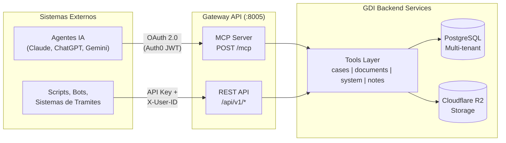

---
hide:
  - toc
---

# Gateway API

**Interfaz publica para integrar sistemas externos con el Sistema de Gestion Documental Inteligente (GDI).**

| Propiedad | Valor |
|-----------|-------|
| Puerto | `:8005` (desarrollo), `:8080` (Docker interno) |
| Framework | FastAPI (ASGI), Python 3.12 |
| Auth MCP | OAuth 2.0 via Auth0 (JWT) |
| Auth REST | API Key + X-User-ID |
| Deploy | Docker |

---

## Que es el Gateway

El Gateway es el punto de entrada para que **sistemas externos** interactuen con GDI sin acceder directamente al Backend. Cualquier municipio que necesite conectar su sistema de tramites, tableros de control, scripts de automatizacion o agentes de inteligencia artificial puede hacerlo a traves de esta API.

El Gateway expone **dos interfaces** segun el tipo de cliente:

<div class="grid cards" markdown>

-   :material-robot:{ .lg .middle } **MCP Server**

    ---

    Protocolo estandar para **agentes de inteligencia artificial** (Claude, ChatGPT, Gemini). Autenticacion automatica via OAuth 2.0. El agente se conecta, se autentica con su cuenta de usuario y opera con los mismos permisos que tendria en la interfaz web.

    **14 tools** de solo lectura.

    [:octicons-arrow-right-24: Ver MCP Server](mcp-server.md)

-   :material-code-json:{ .lg .middle } **REST API**

    ---

    Endpoints HTTP clasicos para **scripts, bots, sistemas de tramites y aplicaciones externas**. Autenticacion por API Key + User ID. Ideal para integraciones programaticas donde no se necesita un agente IA.

    **45 endpoints** organizados por dominio.

    [:octicons-arrow-right-24: Ver REST API](rest-api/index.md)

</div>

---

## Arquitectura



!!! info "Misma logica, distinta interfaz"
    Ambas interfaces (MCP y REST) comparten la misma capa de tools internamente. Un `search_cases` por MCP ejecuta exactamente el mismo codigo que `GET /api/v1/cases/search` por REST. La unica diferencia es el metodo de autenticacion y el formato de entrada/salida.

---

## Resumen de Operaciones

El Gateway organiza sus operaciones en **4 dominios funcionales**:

### Expedientes (13 endpoints)

| Operacion | MCP Tool | REST Endpoint |
|-----------|----------|---------------|
| Buscar expedientes | `search_cases` | `GET /api/v1/cases/search` |
| Detalle de expediente | `get_case` | `GET /api/v1/cases/{id}` |
| Historial de movimientos | `get_case_history` | `GET /api/v1/cases/{id}/history` |
| Documentos del expediente | `get_case_documents` | `GET /api/v1/cases/{id}/documents` |
| Permisos del usuario | `get_case_permissions` | `GET /api/v1/cases/{id}/permissions` |
| Buscar por numero | `get_case_by_number` | `GET /api/v1/cases/by-number/{number}` |
| Preparar pase | `prepare_assignment` | `POST /api/v1/cases/{id}/prepare-assignment` |
| Ejecutar pase | `assign_case` | `POST /api/v1/cases/{id}/assign` |
| Preparar transferencia | `prepare_transfer` | `POST /api/v1/cases/{id}/prepare-transfer` |
| Templates disponibles | `get_case_templates` | `GET /api/v1/system/case-templates` |
| Crear documento en expediente | `create_document` | `POST /api/v1/documents` |
| Guardar documento | `save_document` | `PUT /api/v1/documents/{id}` |
| Proponer documento | `propose_document` | `POST /api/v1/documents/{id}/propose` |

### Documentos (20 endpoints)

| Operacion | MCP Tool | REST Endpoint |
|-----------|----------|---------------|
| Buscar documentos | `search_documents` | `GET /api/v1/documents/search` |
| Detalle de documento | `get_document` | `GET /api/v1/documents/{id}` |
| Contenido HTML | `get_document_content` | `GET /api/v1/documents/{id}/content` |
| Firmas pendientes | `get_pending_signatures` | `GET /api/v1/documents/pending-signatures` |
| Tipos de documentos | `get_document_types` | `GET /api/v1/system/document-types` |
| Estados de documento | `get_document_states` | `GET /api/v1/documents/states` |
| Buscar por numero | `search_document_by_number` | `GET /api/v1/documents/by-number/{number}` |
| Crear documento | `create_document` | `POST /api/v1/documents` |
| Guardar borrador | `save_document` | `PUT /api/v1/documents/{id}` |
| Proponer documento | `propose_document` | `POST /api/v1/documents/{id}/propose` |
| Rechazar documento | `reject_document` | `POST /api/v1/documents/{id}/reject` |
| Rechazar propuesta | `reject_proposal` | `POST /api/v1/documents/{id}/reject-proposal` |
| Iniciar firma | `start_signing` | `POST /api/v1/documents/{id}/sign` |
| Detalle de firma | `get_signature_details` | `GET /api/v1/documents/{id}/signature` |
| Descargar PDF | - | `GET /api/v1/documents/{id}/download` |
| Preview PDF | - | `GET /api/v1/documents/{id}/preview` |
| Historial de documento | - | `GET /api/v1/documents/{id}/history` |
| Adjuntos | - | `GET /api/v1/documents/{id}/attachments` |
| Subir adjunto | - | `POST /api/v1/documents/{id}/attachments` |
| Eliminar adjunto | - | `DELETE /api/v1/documents/{id}/attachments/{att_id}` |

### Sistema y Catalogos (7 endpoints)

| Operacion | MCP Tool | REST Endpoint |
|-----------|----------|---------------|
| Tipos de documentos | `get_document_types` | `GET /api/v1/system/document-types` |
| Sectores y departamentos | - | `GET /api/v1/system/sectors` |
| Info de usuario | `get_user_info` | `GET /api/v1/system/users/{id}` |
| Templates de expedientes | `get_case_templates` | `GET /api/v1/system/case-templates` |
| Buscar usuarios | `search_users` | `GET /api/v1/system/users/search` |
| Mis tenants | `list_my_tenants` | `GET /api/v1/system/my-tenants` |
| Guia del agente | `get_agent_guide` | `GET /api/v1/system/agent-guide` |

### Notas (5 endpoints)

| Operacion | MCP Tool | REST Endpoint |
|-----------|----------|---------------|
| Notas recibidas | `get_notes` | `GET /api/v1/notes` |
| Notas enviadas | `get_sent_notes` | `GET /api/v1/notes/sent` |
| Notas archivadas | `get_archived_notes` | `GET /api/v1/notes/archived` |
| Detalle de nota | `get_note_detail` | `GET /api/v1/notes/{id}` |
| Enviar nota | - | `POST /api/v1/notes` |

---

## Tu primera llamada en 5 minutos

!!! tip "Prerequisito"
    Necesitas una **API Key** y un **User ID** que te proporcionara el administrador de tu municipio. Si no los tienes, contacta al area de sistemas de tu organizacion.

### 1. Obtener credenciales

Solicita al administrador de GDI de tu municipio:

- **API Key**: cadena con formato `sk-gdi-xxx` (se genera desde el BackOffice)
- **User ID**: UUID del usuario con el que operaras (ej: `550e8400-e29b-41d4-a716-446655440000`)

### 2. Hacer tu primera consulta

Buscar expedientes activos:

```bash
curl -H "X-API-Key: tu-api-key" \
     -H "X-User-ID: tu-user-id" \
     "https://gateway.tu-municipio.gdilatam.com/api/v1/cases/search?page=1&status=active"
```

### 3. Verificar la respuesta

Si todo esta correcto, recibiras un JSON con los expedientes accesibles para ese usuario:

```json
{
  "cases": [
    {
      "case_id": "a1b2c3d4-e5f6-7890-abcd-ef1234567890",
      "case_number": "EE-2026-00042-SMG-ADGEN",
      "reference": "Habilitacion comercial - Farmacia San Martin",
      "status": "active",
      "admin_sector": "ADGEN",
      "current_sector": "Direccion de Habilitaciones",
      "created_at": "2026-02-10T14:30:00",
      "last_modified_at": "2026-03-01T09:15:00"
    }
  ],
  "total": 1,
  "page": 1,
  "page_size": 20
}
```

!!! warning "Permisos"
    El usuario asociado a la API Key solo vera los expedientes y documentos a los que tiene acceso segun su sector y rol dentro de GDI. Los mismos permisos que aplican en la interfaz web aplican en la API.

---

## Secciones de esta guia

<div class="grid cards" markdown>

-   :material-key:{ .lg .middle } **Autenticacion**

    ---

    Como autenticarse por REST (API Key) y por MCP (OAuth 2.0). Tablas de BD, errores comunes y flujo completo.

    [:octicons-arrow-right-24: Autenticacion](autenticacion.md)

-   :material-robot:{ .lg .middle } **MCP Server**

    ---

    Referencia completa de los 14 tools MCP, parametros, respuestas y flujos recomendados para agentes IA.

    [:octicons-arrow-right-24: MCP Server](mcp-server.md)

-   :material-code-json:{ .lg .middle } **REST API**

    ---

    Referencia completa de los 45 endpoints REST organizados por dominio, con ejemplos curl y respuestas.

    [:octicons-arrow-right-24: REST API](rest-api/index.md)

-   :material-swap-horizontal:{ .lg .middle } **Flujos Completos**

    ---

    Ejemplos paso a paso de operaciones comunes: buscar expediente, crear documento, firmar, consultar historial.

    [:octicons-arrow-right-24: Flujos completos](flujos.md)

-   :material-alert-circle:{ .lg .middle } **Errores**

    ---

    Catalogo completo de errores HTTP, codigos, mensajes y como resolverlos.

    [:octicons-arrow-right-24: Errores](errores.md)

</div>
