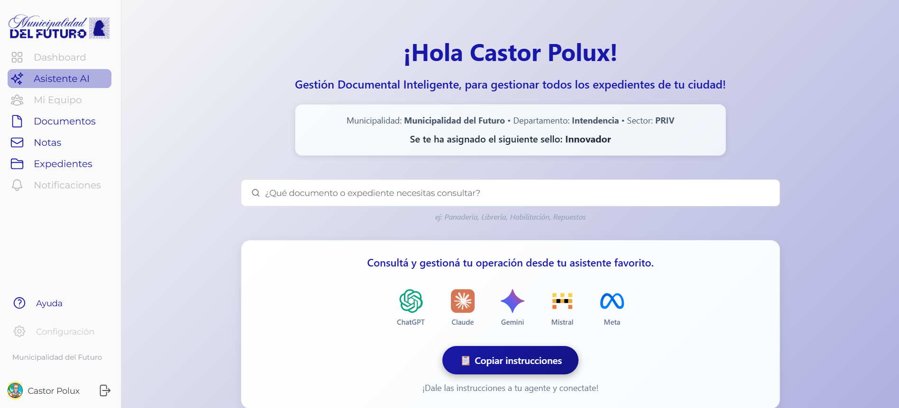
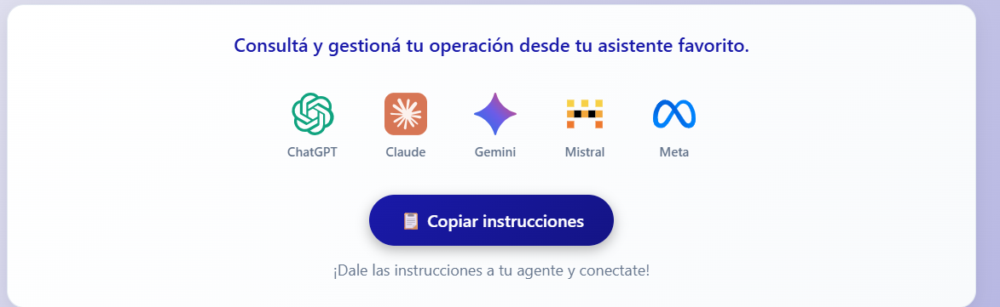
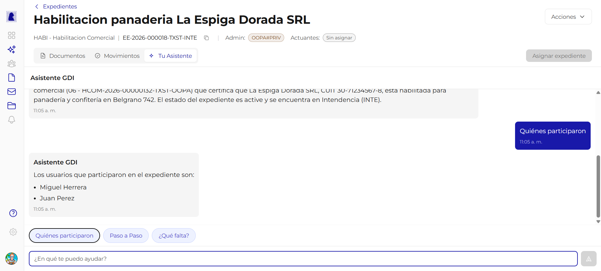

# Asistente AI

El Asistente AI es una herramienta integrada en GDI que permite consultar informacion sobre expedientes y documentos usando **lenguaje natural**. Esta disponible en dos contextos: la pantalla Home (para conectar agentes externos) y dentro de cada expediente (para consultar su contenido).

---

## Asistente en la pantalla Home

Desde la pantalla Home, debajo del buscador, se encuentra la seccion de integracion con asistentes AI externos.

La pantalla muestra:

- El mensaje *"Consulta y gestiona tu operacion desde tu asistente favorito."*
- Los logos de los asistentes compatibles: **ChatGPT**, **Claude**, **Gemini**, **Mistral** y **Meta**.
- El boton **"Copiar instrucciones"**.
- El texto *"Dale las instrucciones a tu agente y conectate!"*.

---

### Como funciona "Copiar instrucciones"

El boton **"Copiar instrucciones"** copia al portapapeles un bloque de texto con las instrucciones necesarias para que un asistente AI externo se conecte al sistema GDI.

| Paso | Accion |
|------|--------|
| 1 | Hacer click en **"Copiar instrucciones"** |
| 2 | Abrir el asistente AI de tu preferencia (ChatGPT, Claude, Gemini, etc.) |
| 3 | Pegar las instrucciones copiadas en el chat del asistente |
| 4 | El asistente se conecta a GDI y puede responder consultas sobre tus expedientes y documentos |

!!! info "Conexion via MCP"
    Las instrucciones copiadas contienen la configuracion necesaria para que el asistente externo se conecte a GDI a traves del protocolo MCP (Model Context Protocol). No es necesario configurar nada manualmente.

---

## Asistente en el Expediente

Dentro de la vista de detalle de un expediente, el tab **"Tu Asistente"** abre un chat integrado que permite hacer preguntas sobre ese expediente especifico.

### Como usarlo

1. Abrir un expediente desde la seccion Expedientes.
2. Hacer click en el tab **"Tu Asistente"**.
3. El asistente genera automaticamente un **resumen del expediente**.
4. Escribir una pregunta en el campo de texto inferior o usar los **chips rapidos**.
5. El asistente responde con informacion del expediente.

---

### Chips rapidos

Los chips rapidos son botones de acceso directo que aparecen debajo del chat. Permiten hacer consultas frecuentes con un solo click.

| Chip | Que hace |
|------|----------|
| **Quienes participaron** | Lista los usuarios que intervinieron en el expediente |
| **Paso a Paso** | Describe la secuencia de movimientos y acciones del expediente en orden cronologico |
| **Que falta?** | Analiza la documentacion del expediente e indica si falta algun documento o paso pendiente |

---

### Campo de texto libre

Ademas de los chips rapidos, se puede escribir cualquier pregunta en el campo de texto con el placeholder *"En que te puedo ayudar?"*. El asistente interpreta la pregunta y responde con informacion del expediente.

Ejemplos de preguntas que se pueden hacer:

| Pregunta | Tipo de respuesta |
|----------|-------------------|
| *"Quien creo este expediente?"* | Nombre del creador y fecha |
| *"Que documentos tiene vinculados?"* | Lista de documentos con tipo, referencia y estado |
| *"Cual fue el ultimo movimiento?"* | Descripcion del ultimo movimiento con fecha y sector |
| *"Resume el expediente en 3 lineas"* | Resumen breve generado por IA |

!!! tip "Resumen automatico"
    Al abrir el tab del asistente por primera vez en un expediente, se genera automaticamente un **Resumen IA** del contenido y el historial del expediente. No es necesario pedirlo.

---

## Preguntas frecuentes

??? question "El asistente puede modificar documentos o expedientes?"
    No. El asistente es de **solo lectura**. Puede consultar informacion, generar resumenes y responder preguntas, pero no puede crear, editar ni firmar documentos.

??? question "El asistente externo (ChatGPT, Claude, etc.) accede a mis datos?"
    El asistente externo se conecta a GDI con las credenciales del usuario. Solo puede acceder a la misma informacion que el usuario ve en el sistema. La conexion es segura y autenticada.

??? question "Puedo usar el asistente del expediente sin conexion?"
    No. El asistente requiere conexion a internet para funcionar, ya que procesa las consultas en tiempo real.
