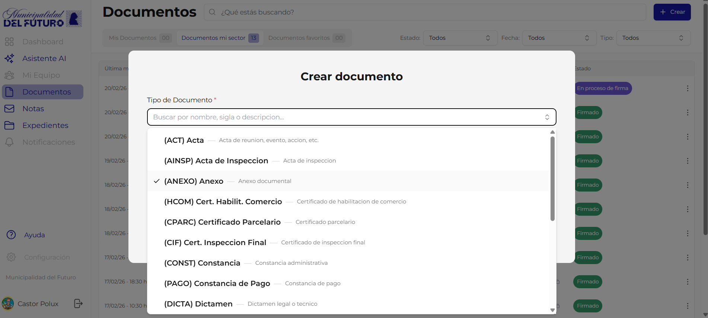
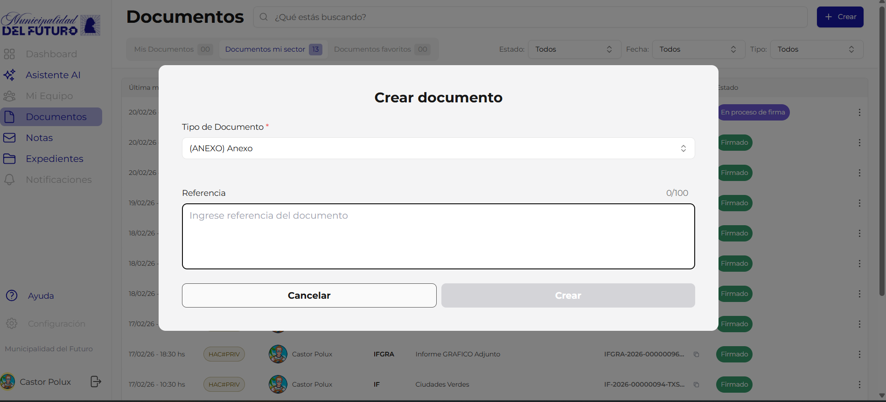
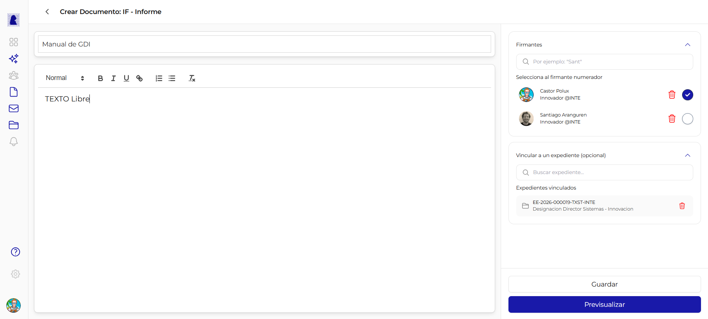
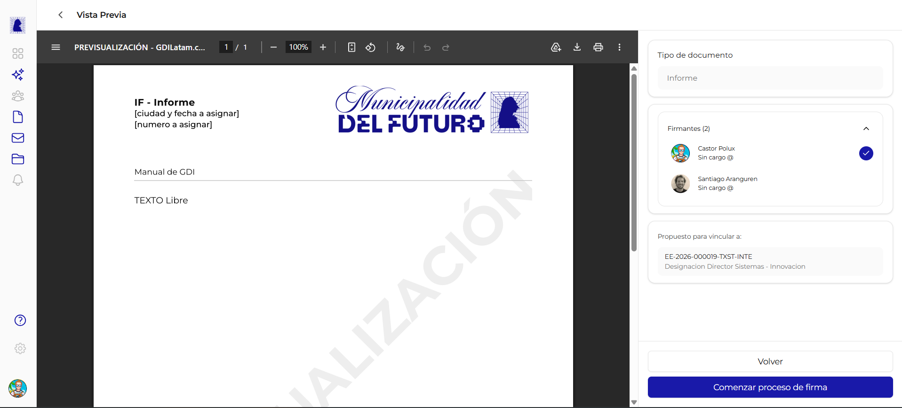

# Crear y Editar Documento

Esta pantalla permite crear un nuevo documento oficial o editar uno existente en estado borrador o rechazado. Se compone de dos zonas: el **panel central** (editor de contenido) y el **panel lateral derecho** (firmantes, vinculacion y acciones).

---

## Paso 1: Abrir el dialogo de creacion

Desde la seccion **Documentos**, hacer click en el boton **"+ Crear"** en la esquina superior derecha. Se abre un dialogo modal con dos campos.



### Campo: Tipo de Documento

| Propiedad | Valor |
|-----------|-------|
| **Tipo de campo** | Selector desplegable con busqueda |
| **Obligatorio** | Si |
| **Busqueda** | Se puede escribir para filtrar por nombre, sigla o descripcion |

Se muestra la lista de tipos disponibles en formato `(SIGLA) Nombre -- Descripcion`. La lista de tipos habilitados depende de la configuracion del municipio. Los tipos se muestran en orden alfabetico.



### Campo: Referencia

| Propiedad | Valor |
|-----------|-------|
| **Tipo de campo** | Texto libre (textarea) |
| **Obligatorio** | Si |
| **Limite** | 100 caracteres (se muestra contador `0/100`) |
| **Placeholder** | *"Ingrese referencia del documento"* |

La referencia es el titulo descriptivo del documento. Aparece en el listado de documentos, en las busquedas y en el encabezado del PDF generado. Ejemplo: *"Informe situacion patrimonial segundo trimestre"*.

### Botones del dialogo

| Boton | Accion |
|-------|--------|
| **Cancelar** | Cierra el dialogo sin crear nada |
| **Crear** | Crea el documento en estado borrador y abre el editor |

!!! warning "Importante"
    La referencia se puede editar despues en el editor. El limite de 100 caracteres aplica solo en este dialogo; en el editor se permite hasta 250 caracteres.

---

## Paso 2: Editor de documento

Al crear el documento, se abre la pantalla de edicion con el panel central y el panel lateral.



### Encabezado

En la parte superior se muestra:

- **Flecha de retorno** (`<`): vuelve al listado de documentos
- **Titulo**: `Crear Documento: {SIGLA} - {Nombre del tipo}` (ej: "Crear Documento: IF - Informe")

---

## Panel central: Contenido del documento

### Campo: Referencia (editable)

| Propiedad | Valor |
|-----------|-------|
| **Tipo de campo** | Texto libre (input) |
| **Obligatorio** | Si |
| **Limite** | 250 caracteres |
| **Ubicacion** | Arriba del editor, campo con borde inferior |

Se carga con el valor ingresado en el dialogo de creacion. Se puede modificar libremente.

### Campo: Cuerpo del documento

| Propiedad | Valor |
|-----------|-------|
| **Tipo de campo** | Editor de texto enriquecido (Quill) |
| **Obligatorio** | Si (para documentos tipo HTML) |
| **Limite** | Sin limite de caracteres |

#### Barra de herramientas del editor

| Herramienta | Funcion |
|-------------|---------|
| **Normal** | Selector de estilo de parrafo (Normal, Titulo 1, Titulo 2, Titulo 3) |
| **B** | Negrita |
| **I** | Cursiva |
| **U** | Subrayado |
| Icono enlace | Insertar hipervinculos |
| Lista numerada | Lista con numeros (1, 2, 3...) |
| Lista con puntos | Lista con puntos |
| **Tx** | Limpiar formato (elimina estilos del texto seleccionado) |

El editor soporta copiar y pegar texto desde procesadores de texto (Word, Google Docs) manteniendo formato basico.

!!! info "Documentos importados (PDF)"
    Para tipos de documento marcados como "Importado" (ej: Informe Grafico Importado, Contrato, Plano), en lugar del editor de texto se muestra una **zona de carga de PDF**. Se puede arrastrar un archivo o hacer click para seleccionarlo.

---

## Panel lateral derecho

El panel lateral contiene tres secciones colapsables y los botones de accion.

### Seccion: Firmantes


| Propiedad | Valor |
|-----------|-------|
| **Obligatorio** | Si (minimo 1 firmante) |
| **Buscador** | Escribir al menos 2 caracteres para buscar usuarios por nombre |

#### Como agregar firmantes

1. Escribir en el campo de busqueda (ej: *"Sant"*)
2. Se despliega una lista de usuarios que coinciden
3. Hacer click en un usuario para agregarlo a la lista de firmantes
4. Repetir para agregar mas firmantes

#### Firmante numerador

El **firmante numerador** es quien otorga el numero oficial al documento. Se identifica con un **check azul** (circulo con tilde) al lado de su nombre.

| Regla | Descripcion |
|-------|-------------|
| Solo puede haber **1 numerador** | Al marcar un firmante como numerador, el anterior se desmarca automaticamente |
| El numerador **firma ultimo** | Independientemente de su posicion en la lista, siempre firma al final |
| Requiere **rango adecuado** | El numerador debe tener el rango necesario para el tipo de documento (ej: un Decreto requiere rango de Intendente) |

#### Acciones sobre firmantes

| Accion | Como |
|--------|------|
| **Marcar como numerador** | Click en el circulo vacio junto al nombre |
| **Eliminar firmante** | Click en el icono de papelera roja |

!!! warning "Validacion de permisos"
    Al previsualizar, el sistema verifica que el numerador tenga el rango necesario para firmar el tipo de documento seleccionado. Si no tiene permisos suficientes, se muestra una advertencia en color amarillo y no se puede iniciar el proceso de firma.

---

### Seccion: Vincular a un expediente (opcional)

| Propiedad | Valor |
|-----------|-------|
| **Obligatorio** | No |
| **Buscador** | Escribir al menos 2 caracteres para buscar expedientes por numero o referencia |
| **Colapsable** | Si (se puede expandir/contraer con la flecha) |

#### Como vincular

1. Expandir la seccion "Vincular a un expediente (opcional)"
2. Escribir en el campo "Buscar expediente..." (ej: *"EE-2026"* o *"Habilitacion"*)
3. Se despliega una lista de expedientes que coinciden
4. Hacer click en un expediente para proponerlo como vinculacion
5. El expediente aparece en la lista "Expedientes vinculados" con su numero y referencia

#### Eliminar vinculacion propuesta

Click en el icono de papelera junto al expediente.

!!! info "Vinculacion propuesta vs. oficial"
    La vinculacion desde esta pantalla es una **propuesta**. El documento aparecera como "Propuesto para vincular" en el expediente destino. El administrador del expediente debera **aceptar o rechazar** la propuesta para que se convierta en vinculacion oficial.

---

### Seccion: Destinatarios (solo para tipo NOTA)

!!! note "Solo visible para documentos tipo NOTA"
    Esta seccion aparece unicamente cuando el tipo de documento es **NOTA**. Para otros tipos no se muestra.

| Propiedad | Valor |
|-----------|-------|
| **Obligatorio** | Si (al menos 1 destinatario en "Para") |

Los destinatarios son **sectores** del organismo (no usuarios individuales):

| Campo | Descripcion | Obligatorio |
|-------|-------------|-------------|
| **Para (TO)** | Sectores destinatarios principales | Si (minimo 1) |
| **CC** | Sectores en copia | No |
| **CCO (BCC)** | Sectores en copia oculta | No |

---

## Acciones: Guardar y Previsualizar

En la parte inferior del panel lateral se encuentran los dos botones de accion.

### Boton: Guardar

| Propiedad | Valor |
|-----------|-------|
| **Estilo** | Boton con borde, texto "Guardar" |
| **Habilitado cuando** | La referencia no esta vacia |

Guarda el estado actual del documento como **borrador**. Se pueden guardar cambios parciales sin necesidad de completar todo. El documento queda en estado **"En edicion"** y se puede continuar editando despues.

Al guardar se envian al servidor: referencia, contenido HTML, lista de firmantes con su orden y numerador, destinatarios (si es NOTA) y expedientes propuestos.

### Boton: Previsualizar

| Propiedad | Valor |
|-----------|-------|
| **Estilo** | Boton azul (primario), texto "Previsualizar" |
| **Habilitado cuando** | La referencia no esta vacia Y el contenido tiene texto |

Guarda automaticamente y luego navega a la **vista previa del documento en formato PDF**.



La vista previa muestra:

- El **PDF generado** con membrete oficial del municipio, referencia y contenido
- Marca de agua **"PREVISUALIZACION"** en diagonal
- Panel lateral con tipo de documento, firmantes y expedientes propuestos
- Botones **"Volver"** (regresa al editor) y **"Comenzar proceso de firma"**

---

## Ciclo de vida del documento

### Estados posibles

| Estado | Descripcion | Se puede editar |
|--------|-------------|:---------------:|
| **En edicion** | Documento en borrador, creado pero no enviado a firmar | Si |
| **En proceso de firma** | Se inicio el proceso de firma. Los firmantes van firmando en orden | No |
| **Firmar ahora** | Es el turno del usuario actual para firmar | No |
| **Firmado** | Todos firmaron. El documento tiene numero oficial | No |
| **Rechazado** | Un firmante o el creador rechazo el documento | Si |

### Flujo completo

```
Crear documento (borrador)
    |
    v
Editar contenido + firmantes + vincular expediente
    |
    v
Previsualizar (genera PDF con marca de agua)
    |
    v
Comenzar proceso de firma (solo el creador puede hacerlo)
    |
    +----> Firmantes firman en orden (1, 2, 3...)
    |          |
    |          +----> Numerador firma ultimo
    |                     |
    |                     v
    |              Documento FIRMADO
    |              (se asigna numero oficial)
    |
    +----> Rechazar (creador o firmante)
               |
               v
          Documento RECHAZADO
          (vuelve a ser editable, ciclo de subsanacion)
```


Al iniciar el proceso de firma, el panel lateral muestra:

- Banner verde: *"El documento se encuentra en proceso de firmas"*
- **Resumen IA**: Se genera automaticamente un resumen del documento
- **Firmantes** con estado (Pendiente / Firmado) y badge **NUM** para el numerador
- **Expedientes propuestos** vinculados
- Botones: **"Firmar Documento"**, **"Cancelar Firma"**, **"Cerrar"**


Al firmar exitosamente se muestra un dialogo de confirmacion con el **numero oficial** asignado al documento (ej: `ANEXO-2026-00000150-TXST-INTE`).

---

## Reglas de negocio

!!! abstract "Resumen de reglas"

    1. **Solo el creador** puede iniciar el proceso de firma
    2. **Solo el creador o un firmante** pueden rechazar un documento en proceso de firma
    3. El **numerador** debe tener el **rango adecuado** para el tipo de documento (ej: un Decreto requiere rango de Intendente)
    4. Los **firmantes regulares firman primero**, en el orden asignado. El numerador firma al final
    5. Al firmar el numerador, se genera el **numero oficial** del documento (ej: `IF-2026-00000122-TXST-INTE`)
    6. Un documento **rechazado** puede ser editado y enviado nuevamente a firma (ciclo de subsanacion)
    7. Los tipos **CAEX** (Caratula de Expediente) y **PV** (Pase de Vista) son autogenerados por el sistema y no aparecen en el selector

---

## Catalogo de tipos de documento

Para ver la lista completa de tipos de documento disponibles en el sistema (HTML, Importados e Internos), consultar el [Catalogo de Tipos de Documento](../catalogos/tipos-de-documento.md).

!!! info "Tipos habilitados"
    Cada municipio define su propia lista de tipos habilitados a partir del catalogo global. La lista que ves en el selector depende de la configuracion de tu municipio.

---

## Formato del numero oficial

Al firmar el numerador, se genera un numero unico con el siguiente formato:

```
{SIGLA}-{ANO}-{SECUENCIAL}-{TENANT}-{DEPARTAMENTO}
```

| Parte | Ejemplo | Descripcion |
|-------|---------|-------------|
| SIGLA | `IF` | Acronimo del tipo de documento |
| ANO | `2026` | Ano de creacion |
| SECUENCIAL | `00000122` | Numero secuencial (8 digitos, unico por tenant) |
| TENANT | `TXST` | Codigo del municipio/tenant |
| DEPARTAMENTO | `INTE` | Acronimo del departamento del numerador |

Ejemplo completo: `IF-2026-00000122-TXST-INTE`

---

## Preguntas frecuentes

??? question "Puedo editar un documento despues de guardarlo?"
    Si. Mientras el documento este en estado **"En edicion"** o **"Rechazado"**, se puede editar libremente: cambiar la referencia, el contenido, los firmantes y los expedientes vinculados.

??? question "Puedo cambiar el tipo de documento despues de crearlo?"
    No. El tipo de documento se define al momento de la creacion y no se puede cambiar despues.

??? question "Que pasa si el numerador no tiene rango suficiente?"
    Al previsualizar se muestra una advertencia. No se podra iniciar el proceso de firma hasta que se cambie el numerador por uno con el rango adecuado.

??? question "Puedo vincular un documento a mas de un expediente?"
    Si. Se pueden proponer vinculaciones a multiples expedientes desde esta pantalla.

??? question "Que pasa si rechazo un documento en proceso de firma?"
    El documento vuelve al estado **"Rechazado"** y se puede editar nuevamente. Esto permite corregir errores y volver a enviarlo a firma (ciclo de subsanacion).

??? question "Quien puede firmar un documento?"
    Solo los usuarios que fueron agregados como firmantes. El orden de firma es: primero los firmantes regulares (en el orden de la lista) y ultimo el numerador.
