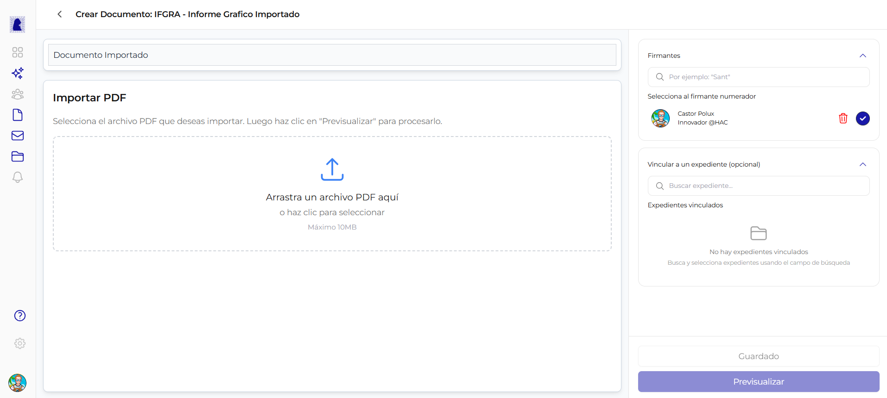

# Documento Importado (PDF)

Un documento importado permite subir un archivo PDF externo al sistema para que forme parte del circuito oficial de firma y numeracion. A diferencia del documento HTML que se redacta en el editor Quill, el documento importado **no tiene editor de texto**: el contenido es el PDF que se carga.

---

## Diferencias con el documento HTML

| Caracteristica | Documento HTML | Documento Importado |
|----------------|:--------------:|:-------------------:|
| Editor Quill (texto enriquecido) | Si | No |
| Barra de herramientas de formato | Si | No |
| Zona de carga de PDF | No | Si |
| Panel lateral (Firmantes, Vincular expediente) | Si | Si |
| Proceso de firma y numeracion | Si | Si |

!!! info "El flujo de firma es identico"
    Una vez cargado el PDF, el documento importado sigue exactamente el mismo circuito de previsualizacion, firma y numeracion que un documento HTML. La unica diferencia es como se genera el contenido.

---

## Panel central: Zona de carga de PDF

Al abrir un documento de tipo importado, el panel central muestra la zona de importacion en lugar del editor de texto.

### Encabezado

En la parte superior se muestra:

- **Flecha de retorno** (`<`): vuelve al listado de documentos
- **Titulo**: `Crear Documento: {SIGLA} - {Nombre del tipo}` (ej: "Crear Documento: IFGRA - Informe Grafico Importado")

### Campo: Referencia

| Propiedad | Valor |
|-----------|-------|
| **Tipo de campo** | Texto libre (input) |
| **Obligatorio** | Si |
| **Limite** | 250 caracteres |
| **Ubicacion** | Arriba de la zona de carga, campo con borde inferior |

Se carga con el valor ingresado en el dialogo de creacion. Se puede modificar libremente.

### Zona de importacion

La zona central muestra el titulo **"Importar PDF"** con el texto descriptivo: *"Selecciona el archivo PDF que deseas importar. Luego haz clic en Previsualizar para procesarlo."*

| Propiedad | Valor |
|-----------|-------|
| **Formato aceptado** | PDF unicamente |
| **Tamano maximo** | 10 MB |
| **Drag & drop** | Si (arrastrar archivo desde el explorador de archivos) |
| **Click para seleccionar** | Si (abre el selector de archivos del sistema operativo) |
| **Icono** | Flecha de carga (upload) |
| **Texto principal** | *"Arrastra un archivo PDF aqui"* |
| **Texto secundario** | *"o haz clic para seleccionar"* |
| **Indicador de limite** | *"Maximo 10MB"* |

!!! warning "Solo un archivo por documento"
    Cada documento importado acepta un unico archivo PDF. Si se necesita adjuntar multiples archivos, se deben crear documentos separados o consolidar los archivos en un solo PDF antes de subirlos.

---

## Tipos de documento importados

Los tipos de documento importados disponibles dependen de la configuracion de cada organizacion. Algunos ejemplos comunes son: Informe Grafico Importado (IFGRA), Contrato (CONT), Oficio Judicial (OFJUD), Plano (PLANO), entre otros.

Para ver la lista completa de tipos de documento importados, consultar el [Catalogo de Tipos de Documento](../catalogos/tipos-de-documento.md#documentos-importados-18-tipos).

---

## Panel lateral derecho

El panel lateral es identico al del documento HTML y contiene las secciones de **Firmantes** y **Vincular a un expediente**. Para una descripcion detallada de cada seccion, consultar [Crear y Editar Documento - Panel lateral derecho](crear-editar-documento.md#panel-lateral-derecho).

### Resumen de secciones

| Seccion | Obligatorio | Descripcion |
|---------|:-----------:|-------------|
| **Firmantes** | Si (minimo 1) | Usuarios que firmaran el documento. Uno se marca como numerador |
| **Vincular a un expediente** | No | Permite proponer la vinculacion a uno o mas expedientes |

!!! note "Sin seccion Destinatarios"
    Los documentos importados no tienen seccion de Destinatarios. Esa seccion es exclusiva del tipo NOTA.

---

## Acciones: Guardar y Previsualizar

En la parte inferior del panel lateral se encuentran los dos botones de accion.

### Boton: Guardar

| Propiedad | Valor |
|-----------|-------|
| **Estilo** | Boton con borde gris, texto "Guardado" cuando ya se guardo |
| **Habilitado cuando** | La referencia no esta vacia |

Guarda el estado actual del documento como borrador, incluyendo el archivo PDF cargado, la lista de firmantes y los expedientes propuestos.

### Boton: Previsualizar

| Propiedad | Valor |
|-----------|-------|
| **Estilo** | Boton azul (primario), texto "Previsualizar" |
| **Habilitado cuando** | La referencia no esta vacia Y se cargo un archivo PDF |

Guarda automaticamente y navega a la vista previa del documento en formato PDF. Desde alli se puede iniciar el proceso de firma.

---

## Preguntas frecuentes

??? question "Que pasa si el archivo PDF supera los 10 MB?"
    El sistema no permite cargar archivos que excedan el limite de 10 MB. Se debe reducir el tamano del archivo (por ejemplo, comprimiendo imagenes o eliminando paginas innecesarias) antes de intentar subirlo nuevamente.

??? question "Puedo reemplazar el PDF despues de cargarlo?"
    Si, mientras el documento este en estado "En edicion" se puede cargar un nuevo archivo PDF que reemplazara al anterior.

??? question "El PDF importado se modifica al firmarse?"
    Si. Al igual que los documentos HTML, el sistema agrega el membrete oficial, la referencia, los datos de firma y el numero oficial al PDF resultante.
