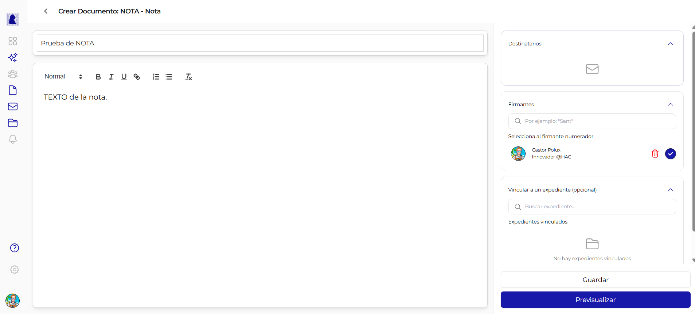
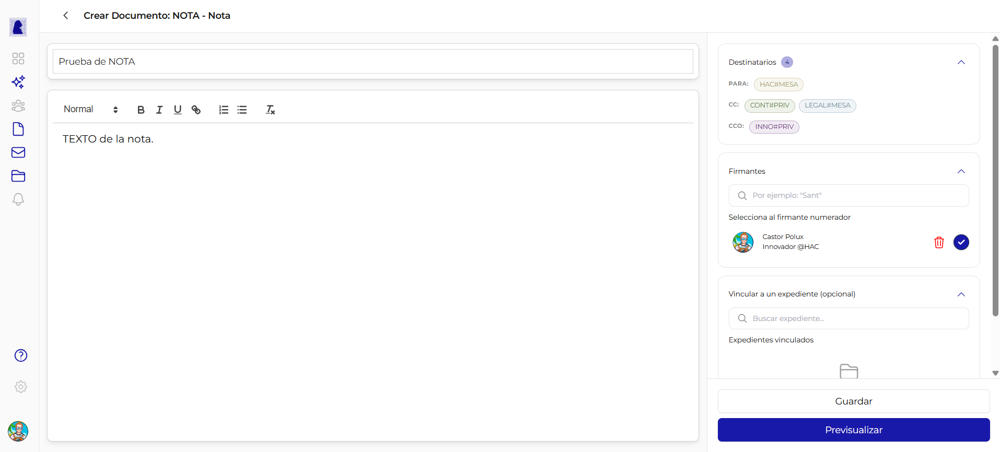

# Documento tipo NOTA

La NOTA es el equivalente digital de un memo o comunicacion interna oficial. Se utiliza para enviar comunicaciones formales entre sectores del organismo. A diferencia de un documento HTML comun, la NOTA incluye una seccion de **Destinatarios** y el PDF generado muestra los campos PARA, CC y CCO en el encabezado.



---

## Diferencias con el documento HTML comun

| Caracteristica | Documento HTML comun | NOTA |
|----------------|:--------------------:|:----:|
| Editor Quill (texto enriquecido) | Si | Si |
| Barra de herramientas de formato | Si | Si |
| Seccion Firmantes | Si | Si |
| Seccion Vincular expediente | Si | Si |
| **Seccion Destinatarios** | No | **Si** |
| **Campos PARA/CC en el PDF** | No | **Si** |
| **Tracking de apertura** | No | **Si** |

!!! info "El PDF de la NOTA incluye destinatarios"
    Al generar el PDF, los sectores destinatarios (PARA y CC) se imprimen en el encabezado del documento, formando parte del registro oficial. Los destinatarios en CCO no aparecen en el PDF.

---

## Panel central: Editor de contenido

El panel central es identico al de un documento HTML comun. Incluye:

- **Campo Referencia** (texto libre, hasta 250 caracteres)
- **Editor Quill** con barra de herramientas (Normal, **B**, *I*, U, enlace, listas, Tx)

Para una descripcion detallada del editor, consultar [Crear y Editar Documento - Panel central](crear-editar-documento.md#panel-central-contenido-del-documento).

---

## Panel lateral: Seccion Destinatarios

La seccion Destinatarios es la **primera seccion** del panel lateral, ubicada arriba de Firmantes y Vincular expediente. Solo aparece cuando el tipo de documento es NOTA.



### Campos de destinatarios

| Campo | Descripcion | Obligatorio | Ubicacion en el PDF |
|-------|-------------|:-----------:|:-------------------:|
| **PARA (TO)** | Sectores destinatarios principales de la comunicacion | Si (minimo 1) | Si |
| **CC** | Sectores que reciben copia de la comunicacion | No | Si |
| **CCO (BCC)** | Sectores que reciben copia oculta | No | No (no aparece en el PDF) |

### Propiedades de la seccion

| Propiedad | Valor |
|-----------|-------|
| **Ubicacion** | Primera seccion del panel lateral derecho |
| **Icono sin destinatarios** | Sobre vacio |
| **Indicador con destinatarios** | Badge numerico con la cantidad total de destinatarios |
| **Obligatorio** | Si (al menos 1 destinatario en PARA) |

---

## Como agregar destinatarios

1. En el panel lateral, localizar la seccion **Destinatarios** (primera seccion, con icono de sobre)
2. Hacer click en la seccion para expandirla
3. Seleccionar el campo deseado: **PARA**, **CC** o **CCO**
4. Escribir en el buscador para filtrar sectores disponibles
5. Hacer click en el sector deseado para agregarlo
6. Repetir para agregar mas destinatarios en cualquiera de los tres campos

Al agregar destinatarios, se muestra un badge numerico junto al titulo de la seccion indicando la cantidad total.

---

## Los destinatarios son sectores

!!! warning "Sectores, no usuarios individuales"
    Los destinatarios de una NOTA son **sectores del organismo** (por ejemplo, Mesa de Entradas de Hacienda), no usuarios individuales. Todos los usuarios asignados a ese sector recibiran la notificacion de la NOTA.

### Formato de los badges de destinatarios

Cada destinatario se muestra como un badge con el formato:

```
DEPARTAMENTO#SECTOR
```

| Parte | Ejemplo | Descripcion |
|-------|---------|-------------|
| DEPARTAMENTO | `HAC` | Acronimo del departamento (ej: Hacienda) |
| `#` | Separador | Caracter separador |
| SECTOR | `MESA` | Acronimo del sector dentro del departamento |

Ejemplo completo: `HAC#MESA` (Mesa de Entradas de Hacienda)

### Colores de los badges por tipo

| Tipo | Color del badge | Ejemplo |
|------|----------------|---------|
| **PARA** | Verde/azul | `HAC#MESA` |
| **CC** | Tono intermedio | `CONT#PRIV`, `LEGAL#MESA` |
| **CCO** | Tono diferenciado | `INNO#PRIV` |

Los colores permiten identificar rapidamente en que campo (PARA, CC o CCO) fue agregado cada destinatario.

---

## Panel lateral: Firmantes y Vincular expediente

Las secciones de **Firmantes** y **Vincular a un expediente** funcionan exactamente igual que en un documento HTML comun. Para una descripcion detallada, consultar:

- [Firmantes](crear-editar-documento.md#seccion-firmantes)
- [Vincular a un expediente](crear-editar-documento.md#seccion-vincular-a-un-expediente-opcional)

---

## Acciones: Guardar y Previsualizar

Los botones de accion funcionan igual que en un documento HTML comun. Al guardar, se envian tambien los destinatarios (PARA, CC, CCO) al servidor.

Para mas detalles, consultar [Crear y Editar Documento - Acciones](crear-editar-documento.md#acciones-guardar-y-previsualizar).

---

## Preguntas frecuentes

??? question "Puedo enviar una NOTA a un usuario especifico?"
    No directamente. Los destinatarios son sectores, no usuarios individuales. Si se necesita dirigir la comunicacion a una persona en particular, se debe seleccionar el sector al que pertenece y mencionar al destinatario en el cuerpo de la NOTA.

??? question "Los destinatarios en CCO pueden ver quienes son los otros destinatarios?"
    Si. Los destinatarios en CCO pueden ver los campos PARA y CC, pero los destinatarios en PARA y CC no pueden ver quienes estan en CCO. El CCO no aparece impreso en el PDF oficial.

??? question "Puedo modificar los destinatarios despues de guardar?"
    Si, mientras el documento este en estado "En edicion" o "Rechazado" se pueden agregar o quitar destinatarios libremente.
