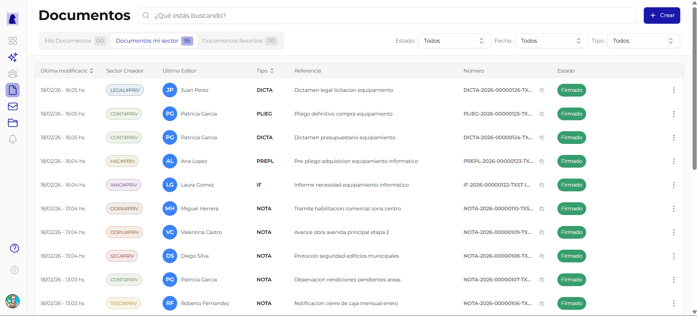

# Documentos

La seccion **Documentos** es el modulo principal de GDI. Desde aqui se crean, editan, firman y gestionan todos los documentos oficiales del organismo.

## Acceso

Desde el **menu lateral izquierdo**, hacer click en **Documentos**. Se muestra una tabla con todos los documentos visibles para el usuario.

## Pantalla principal: Listado de documentos

### Pestanas de filtrado

| Pestana | Que muestra |
|---------|-------------|
| **Mis Documentos** | Documentos creados por el usuario actual |
| **Documentos mi sector** | Documentos creados por cualquier usuario del sector al que pertenece el usuario |
| **Documentos favoritos** | Documentos marcados como favorito por el usuario |

### Filtros adicionales

En la parte superior derecha de la tabla se encuentran tres selectores:

| Filtro | Opciones | Descripcion |
|--------|----------|-------------|
| **Estado** | Todos, En edicion, En proceso de firma, Firmado, Rechazado | Filtrar documentos por su estado actual |
| **Fecha** | Todos, Hoy, Esta semana, Este mes | Filtrar por rango de fecha de ultima modificacion |
| **Tipo** | Todos, IF, NOTA, DICTA, etc. | Filtrar por tipo de documento |

### Columnas de la tabla

| Columna | Descripcion |
|---------|-------------|
| **Ultima modificacion** | Fecha y hora del ultimo cambio en el documento |
| **Sector Creador** | Sector del usuario que creo el documento (ej: `LEGAL#PRIV`) |
| **Ultimo Editor** | Avatar e iniciales + nombre del ultimo usuario que edito |
| **Tipo** | Acronimo del tipo de documento (IF, NOTA, DICTA, etc.) |
| **Referencia** | Titulo descriptivo del documento |
| **Numero** | Numero oficial asignado al firmar (ej: `IF-2026-00000122-TXST-INTE`) |
| **Estado** | Badge de color con el estado actual (verde=Firmado, azul=En proceso, etc.) |

### Buscador

En la parte superior central hay un campo de busqueda con placeholder *"Que estas buscando?"*. Permite buscar por referencia, numero o contenido del documento.

### Boton Crear

En la esquina superior derecha, el boton **"+ Crear"** abre el dialogo para crear un nuevo documento. Ver [Crear y Editar Documento](crear-editar-documento.md).

## Paginas de esta seccion

| Pagina | Descripcion |
|--------|-------------|
| [Crear y Editar Documento](crear-editar-documento.md) | Como crear un documento nuevo, completar campos, agregar firmantes y previsualizar |
| [Documento Importado (PDF)](documento-importado.md) | Como crear un documento subiendo un archivo PDF externo |
| [Documento tipo NOTA](documento-nota.md) | Como crear una nota oficial con destinatarios, copia y copia oculta |
| [Previsualizar Documento](previsualizar-documento.md) | Vista previa en formato PDF antes de enviar a firma |
| [Proceso de Firma](proceso-de-firma.md) | Como funciona el circuito de firmas, orden de firmantes y numerador |
| [Rechazar y Subsanar](rechazar-y-subsanar.md) | Como rechazar un documento y corregirlo en el ciclo de subsanacion |
