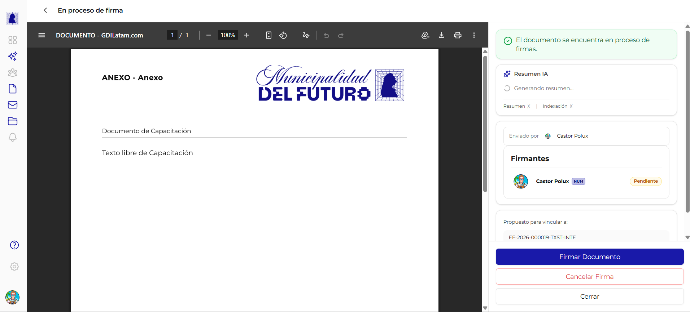
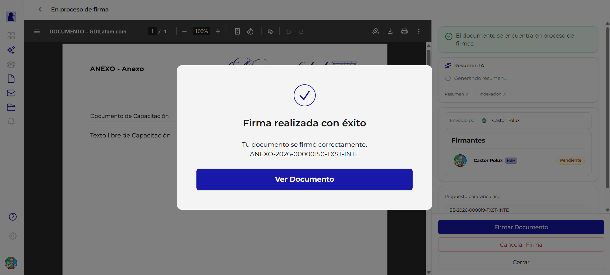

# Proceso de Firma

Una vez que se inicia el proceso de firma desde la previsualizacion, el documento entra en un circuito donde los firmantes deben firmar en orden. Esta pantalla muestra el estado actual del proceso, permite firmar y ofrece la opcion de cancelar la firma si se detecta un error.



---

## Como llegar a esta pantalla

Desde la [previsualizacion del documento](previsualizar-documento.md), hacer click en el boton **"Comenzar proceso de firma"**. Tambien se accede al abrir un documento que ya se encuentra en estado "En proceso de firma" o "Firmar ahora" desde el listado de documentos.

---

## Encabezado

En la parte superior se muestra:

- **Flecha de retorno** (`<`): vuelve al listado de documentos
- **Titulo**: "En proceso de firma"

---

## Visor PDF

El area principal muestra el documento en formato PDF sin marca de agua. La barra de herramientas del visor muestra el titulo **"DOCUMENTO - GDILatam.com"** e incluye las mismas funcionalidades de navegacion, zoom, descarga e impresion que la previsualizacion.

!!! info "Sin marca de agua"
    A diferencia de la previsualizacion, el PDF en esta etapa ya **no muestra la marca de agua "PREVISUALIZACION"**. Sin embargo, el documento aun no tiene numero oficial hasta que el numerador firme.

---

## Panel lateral derecho

El panel lateral muestra la informacion del proceso de firma y las acciones disponibles.

### Banner de estado

| Propiedad | Valor |
|-----------|-------|
| **Color** | Verde |
| **Texto** | *"El documento se encuentra en proceso de firmas."* |
| **Ubicacion** | Parte superior del panel lateral |

### Resumen generado por IA

| Propiedad | Valor |
|-----------|-------|
| **Estado inicial** | *"Generando resumen..."* con indicador de carga (spinner) |
| **Contenido** | Resumen automatico del contenido del documento |
| **Links** | "Resumen X" y "Indexacion X" (cerrar/expandir cada seccion) |

El sistema genera automaticamente un resumen del documento utilizando inteligencia artificial. Este resumen facilita a los firmantes comprender rapidamente el contenido antes de firmar.

### Enviado por

Muestra el nombre y avatar del usuario que inicio el proceso de firma (el creador del documento).

### Firmantes y estados

La seccion de firmantes muestra a cada firmante con su estado actual y los badges correspondientes.

#### Estados de un firmante

| Estado | Badge | Color | Descripcion |
|--------|-------|-------|-------------|
| **Pendiente** | `Pendiente` | Amarillo | El firmante aun no ha firmado. Puede ser que no sea su turno todavia |
| **Firmado** | `Firmado` | Verde | El firmante ya firmo el documento |

#### Badges especiales

| Badge | Color | Significado |
|-------|-------|-------------|
| **NUM** | Azul oscuro | Indica que este firmante es el **numerador** (firma ultimo y asigna el numero oficial) |

Ejemplo de como se muestra un firmante numerador pendiente:

```
Castor Polux  [NUM]  [Pendiente]
```

### Expedientes propuestos

Si el documento tiene expedientes propuestos para vinculacion, se muestran con su numero y referencia:

```
Propuesto para vincular a:
EE-2026-000019-TXST-INTE / Designacion Director Sistemas - Innovacion
```

---

## Acciones

En la parte inferior del panel lateral se encuentran los botones de accion. Los botones visibles dependen del rol del usuario y del estado del documento.

### Boton: Firmar Documento

| Propiedad | Valor |
|-----------|-------|
| **Estilo** | Boton azul (primario) |
| **Visible cuando** | Es el turno del usuario actual para firmar |
| **Accion** | Registra la firma del usuario en el documento |

### Boton: Cancelar Firma

| Propiedad | Valor |
|-----------|-------|
| **Estilo** | Texto rojo (sin fondo) |
| **Visible cuando** | El usuario es el creador o un firmante del documento |
| **Accion** | Abre el dialogo de rechazo. Ver [Rechazar y Subsanar](rechazar-y-subsanar.md) |

### Boton: Cerrar

| Propiedad | Valor |
|-----------|-------|
| **Estilo** | Boton gris (secundario) |
| **Accion** | Cierra la pantalla y vuelve al listado de documentos |

---

## Dialogo de firma exitosa

Al firmar correctamente, se muestra un dialogo modal de confirmacion.



### Contenido del dialogo

| Elemento | Valor |
|----------|-------|
| **Icono** | Check azul (circulo con tilde) |
| **Titulo** | *"Firma realizada con exito"* |
| **Mensaje** | *"Tu documento se firmo correctamente."* |
| **Numero oficial** | Se muestra cuando el numerador firma (ej: `ANEXO-2026-00000150-TXST-INTE`) |
| **Boton** | **"Ver Documento"** (azul) - abre el documento firmado |

!!! note "Numero oficial"
    El numero oficial solo se asigna cuando firma el **numerador** (ultimo firmante). Si un firmante regular firma, el dialogo de exito no muestra numero oficial porque el documento aun no esta completamente firmado.

### Formato del numero oficial

El numero oficial se genera con el formato:

```
{SIGLA}-{ANO}-{SECUENCIAL}-{TENANT}-{DEPARTAMENTO}
```

Para una descripcion detallada del formato, consultar [Crear y Editar Documento - Formato del numero oficial](crear-editar-documento.md#formato-del-numero-oficial).

---

## Reglas de negocio

!!! abstract "Resumen de reglas del proceso de firma"

    1. **Solo el creador** puede iniciar el proceso de firma desde la previsualizacion
    2. Los **firmantes regulares firman primero**, en el orden en que fueron agregados a la lista
    3. El **numerador firma ultimo**, independientemente de su posicion en la lista original
    4. Al firmar el numerador, se genera el **numero oficial** del documento
    5. El **creador o cualquier firmante** pueden cancelar la firma (el documento vuelve a edicion)
    6. Al cancelar la firma, **todas las firmas realizadas se eliminan** y el proceso debe reiniciarse
    7. Un firmante solo puede firmar cuando **es su turno** (todos los anteriores ya firmaron)

---

## Preguntas frecuentes

??? question "Puedo firmar un documento si no es mi turno?"
    No. Los firmantes deben firmar en el orden establecido. El boton "Firmar Documento" solo aparece cuando es tu turno.

??? question "Que pasa si cancelo la firma despues de que otros ya firmaron?"
    Al cancelar la firma, se eliminan todas las firmas realizadas y el documento vuelve al estado "Rechazado". Todos los firmantes deberan firmar nuevamente si se reenvia a firma.

??? question "Quien puede ver el documento en proceso de firma?"
    El creador y todos los firmantes pueden acceder al documento mientras esta en proceso de firma. Los firmantes ven el boton "Firmar Documento" solo cuando es su turno.
