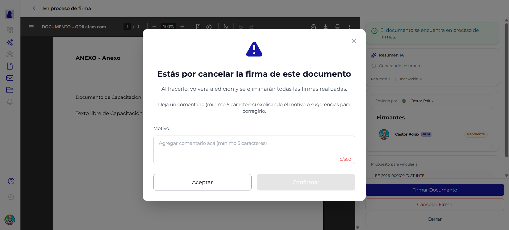

# Rechazar y Subsanar Documento

Cuando un documento en proceso de firma contiene errores o necesita correcciones, cualquier firmante o el creador pueden cancelar la firma. El documento vuelve al estado editable para ser corregido y reenviado a firma. Este ciclo se conoce como **subsanacion**.



---

## Como cancelar una firma

Desde la pantalla de [Proceso de Firma](proceso-de-firma.md), hacer click en el boton **"Cancelar Firma"** (texto rojo en la parte inferior del panel lateral). Se abre un dialogo modal de confirmacion.

---

## Dialogo de rechazo

Al hacer click en "Cancelar Firma", se muestra un dialogo modal con un icono de advertencia (triangulo amarillo).

### Contenido del dialogo

| Elemento | Valor |
|----------|-------|
| **Icono** | Triangulo amarillo de advertencia |
| **Titulo** | *"Estas por cancelar la firma de este documento"* |
| **Mensaje 1** | *"Al hacerlo, volvera a edicion y se eliminaran todas las firmas realizadas."* |
| **Mensaje 2** | *"Deja un comentario (minimo 5 caracteres) explicando el motivo o sugerencias para corregirlo."* |

### Campo: Motivo

| Propiedad | Valor |
|-----------|-------|
| **Tipo de campo** | Textarea (area de texto) |
| **Placeholder** | *"Agregar comentario aca (minimo 5 caracteres)"* |
| **Minimo** | 5 caracteres |
| **Maximo** | 500 caracteres |
| **Contador** | Se muestra `0/500` y se actualiza al escribir |
| **Obligatorio** | Si |

!!! warning "El motivo es obligatorio"
    No se puede confirmar el rechazo sin escribir un motivo de al menos 5 caracteres. El boton "Confirmar" permanece deshabilitado (gris) hasta que se cumpla este requisito.

### Botones del dialogo

| Boton | Estilo | Accion | Estado |
|-------|--------|--------|--------|
| **Aceptar** | Blanco con borde (secundario) | Cierra el dialogo sin cancelar la firma. El documento sigue en proceso de firma | Siempre habilitado |
| **Confirmar** | Gris (deshabilitado) / Activo al escribir motivo | Confirma el rechazo. El documento vuelve a estado editable | Deshabilitado hasta que el motivo tenga al menos 5 caracteres |

!!! info "Nombre de los botones"
    El boton **"Aceptar"** cierra el dialogo (es decir, se acepta que no se quiere rechazar). El boton **"Confirmar"** es el que efectivamente ejecuta el rechazo del documento.

---

## Flujo de subsanacion

El ciclo de subsanacion es el proceso completo desde el rechazo hasta el reenvio a firma:

```
Documento en proceso de firma
    |
    v
Cancelar Firma (boton rojo)
    |
    v
Dialogo de rechazo (escribir motivo)
    |
    v
Confirmar rechazo
    |
    v
Documento vuelve a estado "Rechazado"
(todas las firmas realizadas se eliminan)
    |
    v
Editar documento (corregir errores)
    |
    v
Previsualizar nuevamente
    |
    v
Comenzar proceso de firma (nuevo ciclo)
```

### Estados involucrados

| Estado | Descripcion | Editable |
|--------|-------------|:--------:|
| **En proceso de firma** | Estado previo al rechazo. Los firmantes van firmando en orden | No |
| **Rechazado** | El documento fue devuelto para correcciones. Todas las firmas se eliminaron | Si |
| **En edicion** | Despues de editar el documento rechazado, vuelve a este estado | Si |
| **En proceso de firma** | Al reenviar a firma, se reinicia el ciclo completo | No |

!!! warning "Las firmas se eliminan al rechazar"
    Al confirmar el rechazo, **todas las firmas realizadas hasta el momento se eliminan**. Cuando el documento se reenvie a firma, todos los firmantes deberan firmar nuevamente desde cero.

---

## Quien puede rechazar un documento

| Rol | Puede rechazar |
|-----|:--------------:|
| **Creador del documento** | Si |
| **Firmante activo** (cualquier firmante asignado) | Si |
| **Usuarios no involucrados** | No |

El creador puede cancelar la firma en cualquier momento del proceso. Los firmantes tambien pueden cancelar cuando acceden al documento en proceso de firma.

---

## Preguntas frecuentes

??? question "Puedo rechazar un documento que ya esta completamente firmado?"
    No. Una vez que todos los firmantes (incluido el numerador) han firmado y se asigno el numero oficial, el documento queda en estado "Firmado" y no se puede rechazar ni modificar.

??? question "El motivo del rechazo queda registrado?"
    Si. El comentario ingresado al rechazar queda registrado en el historial del documento. Los otros firmantes y el creador pueden verlo para entender que correcciones se necesitan.

??? question "Cuantas veces se puede rechazar y subsanar un documento?"
    No hay limite. El ciclo de subsanacion (rechazar, corregir, reenviar a firma) se puede repetir las veces que sea necesario hasta que todos los firmantes esten conformes con el contenido.
