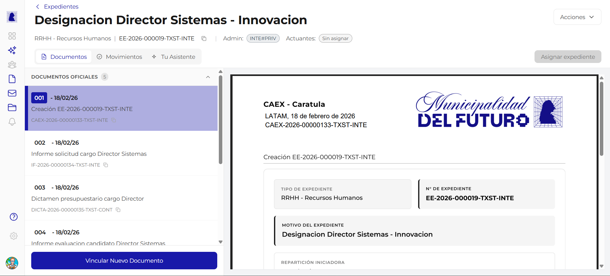

# Detalle del Expediente

Esta pantalla muestra la informacion completa de un expediente electronico: sus datos de cabecera, los documentos que lo componen, los documentos propuestos pendientes de aceptacion, y las acciones disponibles. Se accede haciendo click en cualquier expediente desde el listado de expedientes.

---

## Header del expediente

En la parte superior de la pantalla se muestra la informacion general del expediente.

| Elemento | Descripcion | Ejemplo |
|----------|-------------|---------|
| **Breadcrumb** | Flecha de retorno (`<`) con texto "Expedientes" para volver al listado | `< Expedientes` |
| **Titulo** | Nombre descriptivo del expediente (motivo de creacion) | *Designacion Director Sistemas - Innovacion* |
| **Tipo** | Categoria del tramite con sigla y nombre completo | `RRHH - Recursos Humanos` |
| **Numero oficial** | Identificador unico del expediente, con boton para copiar al portapapeles | `EE-2026-000019-TXST-INTE` |
| **Administrador** | Sector que tiene el control actual del expediente | `INTE#PRIV` |
| **Actuantes** | Usuarios asignados como responsables del seguimiento | *Sin asignar* |

---

## Tabs disponibles

La pantalla se organiza en tres pestanas:

| Tab | Descripcion |
|-----|-------------|
| **Documentos** | Lista de documentos oficiales y propuestos del expediente (tab por defecto) |
| **Movimientos** | Historial de actividad y acciones realizadas sobre el expediente |
| **Tu Asistente** | Asistente de inteligencia artificial para consultas sobre el expediente |

---

## Tab Documentos

Esta es la pestana principal y se muestra activa por defecto al abrir el detalle del expediente.

### Documentos oficiales

La seccion **"DOCUMENTOS OFICIALES"** muestra un badge con la cantidad total de documentos incorporados al expediente. Los documentos se listan en orden cronologico, numerados secuencialmente.

Cada fila de documento muestra:

| Columna | Descripcion | Ejemplo |
|---------|-------------|---------|
| **Numero de orden** | Posicion dentro del expediente (001, 002, 003...) | `001` |
| **Fecha** | Fecha de incorporacion al expediente | `18/02/26` |
| **Referencia** | Titulo descriptivo del documento | *Creacion EE-2026-000019-TXST-INTE* |
| **Numero oficial** | Identificador unico del documento, con boton para copiar | `CAEX-2026-00000133-TXST-INTE` |

Al hacer click en un documento de la lista, se muestra una **vista previa del PDF** en el panel derecho. Por ejemplo, al seleccionar el documento 001 (la caratula CAEX), se muestra el PDF con el logo del municipio, el tipo de expediente, el numero oficial, el motivo y la reparticion iniciadora.

!!! info "Primer documento: Caratula (CAEX)"
    El documento numero 001 de todo expediente es siempre la **caratula** (tipo CAEX), generada automaticamente por el sistema al crear el expediente. Contiene los datos basicos: tipo, numero, motivo y reparticion iniciadora.

### Documentos propuestos

Debajo de los documentos oficiales se encuentra la seccion **"DOCUMENTOS PROPUESTOS"**, que muestra los documentos cuya vinculacion fue solicitada pero aun no fue aceptada por el administrador del expediente.

Cada documento propuesto muestra:

| Elemento | Descripcion |
|----------|-------------|
| **Badge "VINCULACION PROPUESTA"** | Etiqueta naranja que indica que el documento esta pendiente de aceptacion |
| **Estado de firma** | Badge gris "En firma" o badge verde "Firmado", segun el estado actual del documento |
| **Menu "Acciones"** | Desplegable con las opciones disponibles segun el estado del documento |

#### Acciones sobre documentos propuestos

| Accion | Disponible cuando | Descripcion |
|--------|-------------------|-------------|
| **Aceptar Vinculacion** | El documento esta **Firmado** | Incorpora el documento al expediente como documento oficial. Se le asigna un numero de orden |
| **Rechazar Vinculacion** | Siempre (Firmado o En firma) | Rechaza la propuesta de vinculacion. El documento no se incorpora al expediente |

!!! warning "Documentos en firma"
    Un documento que esta **"En firma"** (aun no fue firmado por todos los firmantes) solo puede ser **rechazado**. La opcion "Aceptar Vinculacion" no esta disponible hasta que el documento este completamente firmado.

---

## Boton "Asignar expediente"

Ubicado en la esquina superior derecha, permite asignar actuantes (usuarios responsables) al expediente. Los actuantes reciben notificaciones sobre la actividad del expediente.

---

## Menu "Acciones"

En la esquina superior derecha se encuentra el boton **"Acciones"** con un desplegable que contiene las operaciones disponibles sobre el expediente, como subsanar documentos, transferir el expediente, y otras acciones administrativas. Las opciones disponibles dependen del rol del usuario y el estado del expediente.

---

## Preguntas frecuentes

??? question "Puedo ver el contenido de un documento sin descargarlo?"
    Si. Al hacer click en cualquier documento de la lista, se muestra una vista previa del PDF en el panel derecho de la pantalla.

??? question "Que significa el numero de orden de cada documento?"
    Es la posicion cronologica del documento dentro del expediente. El 001 es siempre la caratula, y los siguientes se numeran en el orden en que fueron incorporados.

??? question "Quien puede aceptar o rechazar documentos propuestos?"
    Solo el **sector administrador** del expediente puede aceptar o rechazar propuestas de vinculacion de documentos.

??? question "Puedo copiar el numero del expediente o de un documento?"
    Si. Junto a cada numero oficial (tanto del expediente como de cada documento) hay un boton de copia que permite copiar el numero al portapapeles con un solo click.

??? question "Que pasa si no tengo actuantes asignados?"
    El expediente funciona normalmente sin actuantes. La asignacion de actuantes es opcional y sirve para designar responsables de seguimiento.
