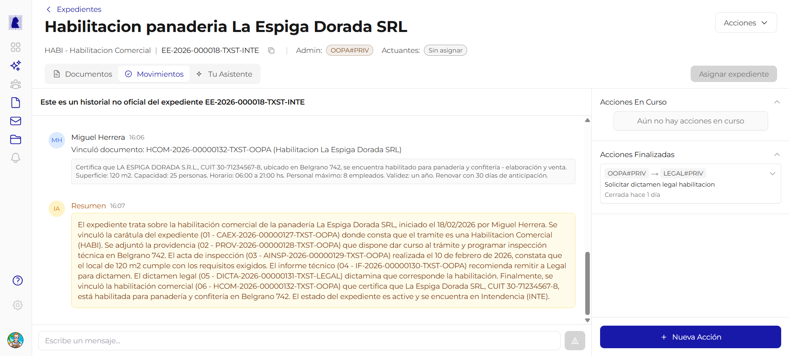
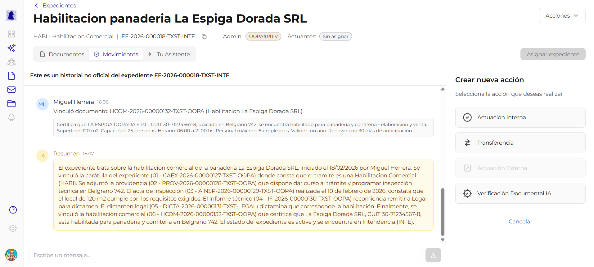
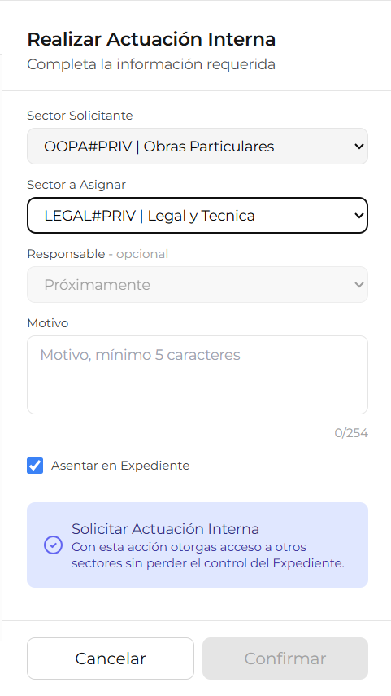

# Movimientos

La pestana **Movimientos** muestra el historial de actividad de un expediente: que documentos se vincularon, que acciones se realizaron, quien las ejecuto y cuando. Tambien permite crear nuevas acciones como actuaciones internas, transferencias y verificaciones con inteligencia artificial.

---

## Timeline de actividad

El area central de la pestana muestra una **linea de tiempo** con los eventos del expediente en orden cronologico. Cada entrada incluye:

| Elemento | Descripcion |
|----------|-------------|
| **Avatar e iniciales** | Identificacion visual del usuario que realizo la accion |
| **Nombre del usuario** | Nombre completo de quien ejecuto la accion |
| **Hora** | Hora en que se registro el evento |
| **Descripcion** | Texto que describe la accion realizada (ej: *"Vinculo documento: HCOM-2026-00000132-TXST-OOPA"*) |
| **Card de resumen** | Tarjeta gris con un resumen del documento vinculado o la accion realizada |

### Resumen IA

Periodicamente el sistema genera un **resumen automatico** del expediente utilizando inteligencia artificial. Este resumen aparece en la timeline como una tarjeta dorada con el contenido sintetizado, identificada con las iniciales "IA".

!!! info "Resumen no oficial"
    El resumen generado por IA es un apoyo informativo. No constituye un documento oficial ni reemplaza la lectura de los documentos del expediente.

### Campo de mensaje

En la parte inferior de la timeline hay un campo de texto con el placeholder *"Escribe un mensaje..."* y un boton de envio. Permite agregar comentarios o anotaciones informales al historial del expediente.

---

## Panel lateral: Acciones

A la derecha de la timeline se encuentra el panel de acciones, dividido en dos secciones.

### Acciones En Curso

Muestra las acciones que estan activas y pendientes de resolucion. Si no hay acciones abiertas, se muestra el mensaje *"Aun no hay acciones en curso"*.

### Acciones Finalizadas

Muestra las acciones que ya fueron completadas o cerradas. Cada accion finalizada indica:

| Dato | Descripcion | Ejemplo |
|------|-------------|---------|
| **Origen** | Sector que inicio la accion | `OOPA#PRIV` |
| **Destino** | Sector al que se dirigio la accion | `LEGAL#PRIV` |
| **Motivo** | Descripcion de la solicitud | *Solicitar dictamen legal habilitacion* |
| **Estado** | Tiempo transcurrido desde el cierre | *Cerrada hace 1 dia* |

---

## Crear nueva accion

Al presionar el boton **"+ Nueva Accion"** (azul, ubicado debajo de la timeline), el panel lateral cambia para mostrar las opciones disponibles.

### Tipos de accion disponibles

| Tipo | Descripcion | Estado |
|------|-------------|--------|
| **Actuacion Interna** | Solicita la intervencion de otro sector sin perder el control del expediente | Disponible |
| **Transferencia** | Transfiere el expediente a otro sector, cediendo el control administrativo | Disponible |
| **Actuacion Externa** | Solicita intervencion de un organismo externo | Proximamente (deshabilitado) |
| **Verificacion Documental IA** | Solicita una verificacion automatica de los documentos del expediente mediante inteligencia artificial | Disponible |

!!! note "Boton Cancelar"
    En cualquier momento se puede presionar **"Cancelar"** para volver al panel de acciones sin crear nada.

---

## Actuacion Interna

La actuacion interna permite solicitar la intervencion de otro sector del organismo **sin perder el control** del expediente. El sector solicitado recibe acceso para consultar y actuar sobre el expediente, pero el sector administrador mantiene la responsabilidad.

### Formulario

| Campo | Tipo | Obligatorio | Descripcion |
|-------|------|:-----------:|-------------|
| **Sector Solicitante** | Selector desplegable | Si | Sector desde el cual se realiza la solicitud. Se precarga con el sector del usuario |
| **Sector a Asignar** | Selector desplegable | Si | Sector al que se solicita la intervencion |
| **Responsable** | Selector desplegable | No | Usuario especifico dentro del sector destino. Proximamente (actualmente deshabilitado) |
| **Motivo** | Textarea | Si | Descripcion de lo que se solicita. Minimo 5 caracteres, maximo 254 caracteres (se muestra contador) |
| **Asentar en Expediente** | Checkbox | No | Si esta marcado, la accion queda registrada en el historial oficial del expediente. Activado por defecto |

!!! info "Solicitar Actuacion Interna"
    Con esta accion otorgas acceso a otros sectores sin perder el control del Expediente. El sector asignado podra consultar los documentos y realizar las tareas solicitadas.

### Botones del formulario

| Boton | Accion |
|-------|--------|
| **Cancelar** | Cierra el formulario sin crear la actuacion |
| **Confirmar** | Crea la actuacion interna. Se habilita cuando todos los campos obligatorios estan completos |

---

## Transferencia

La transferencia **mueve el control** del expediente a otro sector. A diferencia de la actuacion interna, el sector que transfiere **pierde el rol de administrador** y el sector destino pasa a ser el nuevo administrador del expediente.

!!! warning "Accion irreversible"
    Al transferir un expediente, el sector de origen pierde el control administrativo. Solo el nuevo sector administrador podra transferirlo nuevamente o realizar acciones sobre el.

---

## Verificacion Documental IA

Solicita una revision automatica de los documentos del expediente utilizando inteligencia artificial. El sistema analiza la documentacion y genera un informe con observaciones, inconsistencias o datos faltantes.

---

## Preguntas frecuentes

??? question "Cual es la diferencia entre actuacion interna y transferencia?"
    La **actuacion interna** otorga acceso temporal a otro sector sin perder el control del expediente. La **transferencia** cede completamente el control administrativo al sector destino.

??? question "Puedo tener varias actuaciones internas abiertas al mismo tiempo?"
    Si. Se pueden crear multiples actuaciones internas dirigidas a diferentes sectores simultaneamente. Todas aparecen en la seccion "Acciones En Curso".

??? question "El historial de movimientos es un registro oficial?"
    No. El banner en la parte superior de la timeline indica que es un *"historial no oficial"*. Sirve como referencia de trabajo pero no constituye un registro legal del expediente.

??? question "Que sucede cuando se cierra una actuacion interna?"
    La accion pasa de "Acciones En Curso" a "Acciones Finalizadas" y se muestra con el tiempo transcurrido desde su cierre.

??? question "Puedo deshacer una transferencia?"
    No directamente. Una vez transferido, solo el nuevo sector administrador puede volver a transferir el expediente al sector original.
