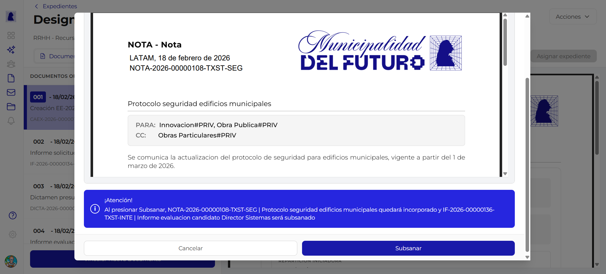
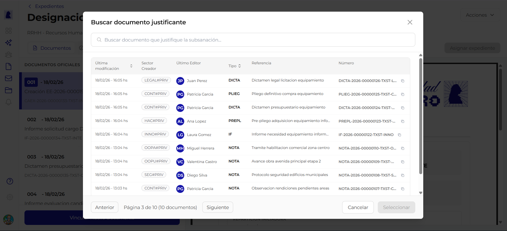

# Subsanar en Expediente

**Subsanar** un documento dentro de un expediente significa reemplazarlo por otro documento que corrige o actualiza la informacion. El documento original queda marcado como subsanado y se incorpora el nuevo documento justificante en su lugar. Este proceso permite corregir errores sin eliminar el registro historico.

---

## Como iniciar

1. Abrir el detalle del expediente
2. En la esquina superior derecha, hacer click en el boton **"Acciones"**
3. Seleccionar la opcion **"Subsanar"** del menu desplegable

Se abre un proceso guiado de dos pasos.

---

## Paso 1: Seleccionar documento a subsanar

Se muestra un modal con el titulo **"Subsanar documento"** y el subtitulo *"Selecciona el documento a subsanar"*.

### Buscador

En la parte superior hay un campo de busqueda con el placeholder *"Buscar documento..."*. Permite filtrar los documentos del expediente por referencia o numero.

### Lista de documentos

Se muestran los documentos del expediente con la siguiente informacion:

| Columna | Descripcion | Ejemplo |
|---------|-------------|---------|
| **Numero de orden** | Posicion del documento dentro del expediente | `004` |
| **Fecha** | Fecha de incorporacion | `18/02/26` |
| **Referencia** | Titulo descriptivo del documento | *Informe evaluacion candidato Director Sistemas* |
| **Numero oficial** | Identificador unico del documento | `IF-2026-00000136-TXST-INTE` |

### Seleccion

Al hacer click en un documento, se resalta con un borde azul y un icono de check, indicando que fue seleccionado.

### Botones

| Boton | Accion |
|-------|--------|
| **Cancelar** | Cierra el modal sin realizar cambios |
| **Siguiente** | Avanza al paso 2 con el documento seleccionado. Se habilita al seleccionar un documento |

---

## Paso 2: Seleccionar documento justificante

Se muestra un segundo modal con el titulo **"Buscar documento justificante"**. El documento justificante es el que reemplazara al documento subsanado dentro del expediente.

### Buscador

Campo de busqueda con el placeholder *"Buscar documento que justifique la subsanacion..."*. Permite buscar por numero, referencia o contenido.

### Tabla de resultados

Los documentos disponibles se muestran en una tabla paginada con las siguientes columnas:

| Columna | Descripcion |
|---------|-------------|
| **Ultima modificacion** | Fecha de la ultima edicion del documento |
| **Sector Creador** | Sector que creo el documento, mostrado como badge |
| **Ultimo Editor** | Avatar y nombre del ultimo editor |
| **Tipo** | Sigla del tipo de documento |
| **Referencia** | Titulo descriptivo |
| **Numero** | Numero oficial del documento |

### Paginacion

La tabla muestra 10 documentos por pagina con botones **"Anterior"** y **"Siguiente"** y el indicador de pagina actual (ej: *"Pagina 3 de 10 (10 documentos)"*).

### Botones

| Boton | Accion |
|-------|--------|
| **Cancelar** | Cierra el modal sin realizar cambios |
| **Seleccionar** | Confirma la seleccion del documento justificante y ejecuta la subsanacion |

---

## Resultado de la subsanacion

Al completar los dos pasos:

- El **documento original** queda marcado como **subsanado** dentro del expediente. No se elimina, pero se identifica visualmente como reemplazado.
- El **documento justificante** se incorpora al expediente como nuevo documento oficial, recibiendo un numero de orden.
- El historial del expediente registra la operacion de subsanacion con la relacion entre ambos documentos.

---

## Reglas de negocio

!!! abstract "Resumen de reglas"

    1. Solo el **sector administrador** del expediente puede ejecutar una subsanacion
    2. El documento a subsanar debe ser un **documento oficial** ya incorporado al expediente
    3. El documento justificante debe estar **firmado** (no se puede usar un documento en borrador o en proceso de firma)
    4. El documento original **no se elimina**: queda en el expediente con la marca de subsanado para preservar el registro historico
    5. La subsanacion queda registrada en el **historial de movimientos** del expediente

---

## Preguntas frecuentes

??? question "Que significa subsanar un documento?"
    Subsanar es el acto de corregir o reemplazar un documento dentro de un expediente. El documento original permanece visible (marcado como subsanado) y el nuevo documento justificante ocupa su funcion.

??? question "El documento subsanado se borra del expediente?"
    No. El documento original permanece en el expediente pero queda identificado como subsanado. Esto garantiza la trazabilidad y el registro historico completo.

??? question "Puedo subsanar la caratula del expediente (CAEX)?"
    No. La caratula es un documento autogenerado por el sistema y no puede ser subsanada.

??? question "Puedo usar como justificante un documento que ya esta en el expediente?"
    No. El documento justificante debe ser un documento externo al expediente que se incorporara como nuevo documento oficial.

??? question "Quien puede ver que un documento fue subsanado?"
    Cualquier usuario con acceso al expediente puede ver la marca de subsanacion y la relacion entre el documento original y el justificante.
