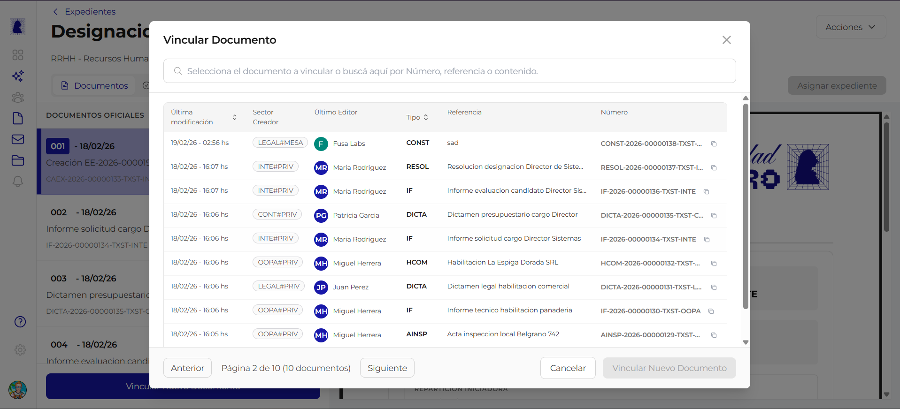
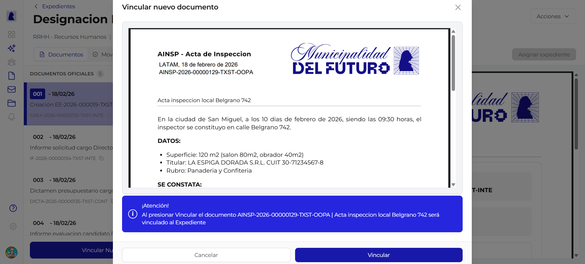
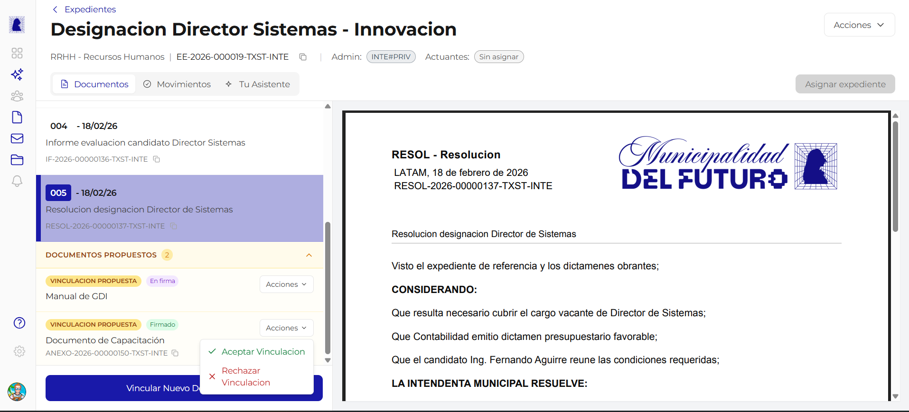
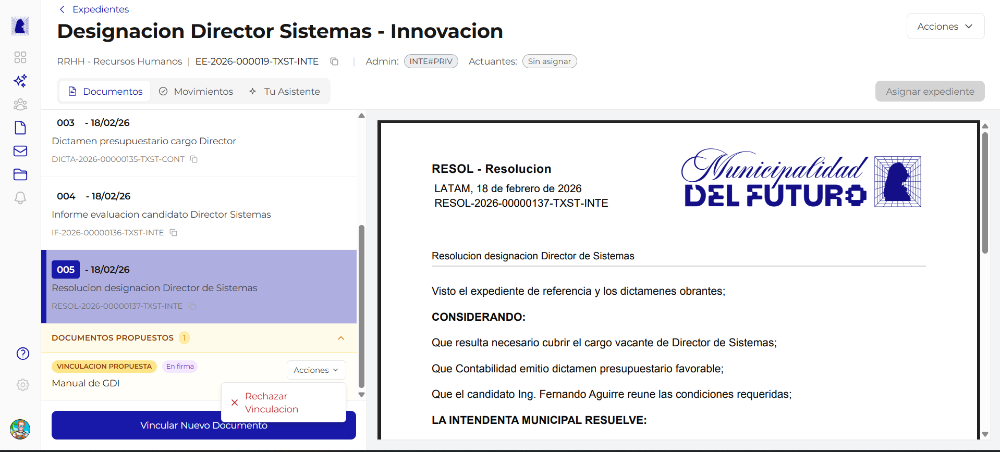

# Vincular Documentos

Vincular un documento a un expediente significa incorporarlo como parte oficial del tramite. Solo los documentos firmados pueden quedar vinculados de forma definitiva. Esta pagina describe el proceso completo: buscar y seleccionar un documento, confirmar la vinculacion, y gestionar las propuestas pendientes.

---

## Iniciar la vinculacion

Desde la pestana **Documentos** del detalle del expediente, presionar el boton azul **"Vincular Nuevo Documento"** ubicado en la parte inferior de la lista de documentos. Se abre un modal de seleccion.

---

## Modal "Vincular Documento"

Este modal permite buscar y seleccionar un documento existente para vincularlo al expediente.

### Buscador

En la parte superior del modal hay un campo de busqueda con el texto guia: *"Selecciona el documento a vincular o busca aqui por Numero, referencia o contenido."* Se puede buscar por:

- Numero oficial del documento (ej: `IF-2026-00000134`)
- Referencia o titulo del documento
- Contenido del documento

### Tabla de resultados

Los documentos se muestran en una tabla paginada con las siguientes columnas:

| Columna | Descripcion |
|---------|-------------|
| **Ultima modificacion** | Fecha de la ultima edicion del documento |
| **Sector Creador** | Sector que creo el documento, mostrado como badge de color |
| **Ultimo Editor** | Avatar y nombre del usuario que edito por ultima vez |
| **Tipo** | Sigla del tipo de documento (ej: CONST, RESOL, IF, DICTA) |
| **Referencia** | Titulo descriptivo del documento |
| **Numero** | Numero oficial del documento, con boton para copiar |

### Paginacion

La tabla muestra 10 documentos por pagina. En la parte inferior se indica la pagina actual y el total (ej: *"Pagina 2 de 10 (10 documentos)"*) con botones **"Anterior"** y **"Siguiente"** para navegar.

### Botones del modal

| Boton | Accion |
|-------|--------|
| **Cancelar** | Cierra el modal sin vincular nada |
| **Vincular Nuevo Documento** | Confirma la seleccion y abre el modal de confirmacion |

---

## Modal "Vincular nuevo documento"

Al seleccionar un documento de la tabla, se abre un segundo modal de confirmacion que muestra:

| Elemento | Descripcion |
|----------|-------------|
| **Vista previa PDF** | Preview del documento seleccionado con su membrete y contenido |
| **Banner de confirmacion** | Mensaje azul que indica el numero oficial y la referencia del documento que se va a vincular al expediente |

### Botones del modal

| Boton | Accion |
|-------|--------|
| **Cancelar** | Vuelve al modal de seleccion sin vincular |
| **Vincular** | Confirma la vinculacion del documento al expediente |

!!! info "Vinculacion como propuesta"
    Si el usuario que vincula no es el administrador del expediente, el documento queda como **propuesta de vinculacion** pendiente de aceptacion. Si el usuario es el administrador, el documento se incorpora directamente como documento oficial.

---

## Documentos propuestos

Los documentos cuya vinculacion fue propuesta (pero aun no aceptada) aparecen en la seccion **"DOCUMENTOS PROPUESTOS"** dentro de la pestana Documentos del expediente.

Cada documento propuesto muestra:

| Elemento | Descripcion |
|----------|-------------|
| **Badge "VINCULACION PROPUESTA"** | Etiqueta naranja que identifica al documento como pendiente de aceptacion |
| **Estado de firma** | Badge que indica si el documento esta "En firma" (gris) o "Firmado" (verde) |
| **Menu "Acciones"** | Desplegable con las opciones disponibles |

---

## Aceptar vinculacion

Para aceptar la vinculacion de un documento propuesto:

1. Ubicar el documento en la seccion **"DOCUMENTOS PROPUESTOS"**
2. Hacer click en el boton **"Acciones"** del documento
3. Seleccionar **"Aceptar Vinculacion"** (icono check verde)

El documento se incorpora a la lista de **documentos oficiales** del expediente y recibe un numero de orden secuencial.

!!! warning "Solo documentos firmados"
    La opcion "Aceptar Vinculacion" solo esta disponible para documentos con estado **"Firmado"**. Un documento que aun esta "En firma" no puede ser aceptado.

---

## Rechazar vinculacion

Para rechazar la vinculacion de un documento propuesto:

1. Ubicar el documento en la seccion **"DOCUMENTOS PROPUESTOS"**
2. Hacer click en el boton **"Acciones"** del documento
3. Seleccionar **"Rechazar Vinculacion"** (icono X rojo)

El documento se elimina de la lista de propuestos. No se incorpora al expediente.

!!! note "Rechazar documentos en firma"
    A diferencia de la aceptacion, la opcion de rechazar esta disponible **siempre**, tanto para documentos "En firma" como para documentos "Firmados".

---

## Reglas de negocio

!!! abstract "Resumen de reglas"

    1. Solo el **sector administrador** del expediente puede aceptar o rechazar propuestas de vinculacion
    2. Un documento debe estar **completamente firmado** para poder ser aceptado como vinculacion oficial
    3. Un documento **en proceso de firma** solo puede ser rechazado, no aceptado
    4. Al aceptar una vinculacion, el documento recibe un **numero de orden** secuencial dentro del expediente
    5. Rechazar una vinculacion **no afecta** al documento original; solo lo quita de la lista de propuestos del expediente
    6. Un mismo documento puede ser propuesto para vinculacion en **multiples expedientes**
