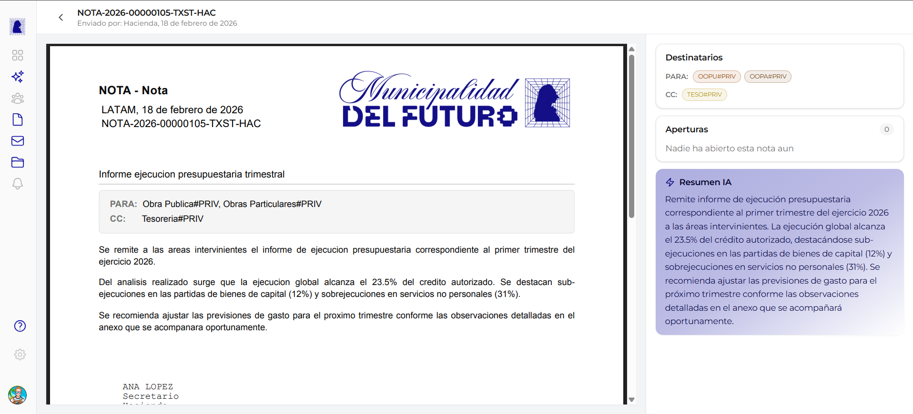

# Nota Enviada

Esta pantalla muestra el detalle de una nota desde la perspectiva del **remitente** (el sector que la creo y firmo). Ademas del contenido de la nota, permite consultar los destinatarios, el tracking de aperturas y el resumen generado por inteligencia artificial.

---

## Header

En la parte superior de la pantalla se muestra la informacion de identificacion de la nota.

| Elemento | Descripcion | Ejemplo |
|----------|-------------|---------|
| **Breadcrumb** | Flecha de retorno (`<`) con el numero oficial de la nota para volver a la bandeja | `< NOTA-2026-00000105-TXST-HAC` |
| **Remitente** | Sector que envio la nota y fecha de envio | *Enviado por: Hacienda, 18 de febrero de 2026* |

---

## PDF de la nota

El area central muestra el documento PDF generado con los siguientes elementos:

| Elemento | Descripcion |
|----------|-------------|
| **Membrete** | Encabezado oficial con el tipo "NOTA - Nota" y datos del municipio |
| **Lugar y fecha** | Localidad y fecha de emision (ej: *LATAM, 18 de febrero de 2026*) |
| **Numero oficial** | Identificador unico de la nota (ej: `NOTA-2026-00000105-TXST-HAC`) |
| **Referencia** | Titulo descriptivo de la nota (ej: *Informe ejecucion presupuestaria trimestral*) |
| **Recuadro de destinatarios** | Bloque destacado con los sectores destinatarios agrupados por modalidad (PARA / CC) |
| **Cuerpo** | Contenido redactado de la nota |
| **Firma** | Nombre, cargo y sector del firmante (ej: *ANA LOPEZ / Secretario / Hacienda*) |

!!! info "Destinatarios en el PDF"
    Los destinatarios aparecen dentro del cuerpo del PDF en un recuadro destacado, indicando las modalidades **PARA** y **CC**. Los destinatarios en **CCO** no se muestran en el PDF.

---

## Panel lateral

A la derecha del PDF se encuentra el panel lateral con tres secciones.

### Destinatarios

Muestra los sectores a los que fue dirigida la nota, agrupados por modalidad. Cada sector se identifica con un badge de color y su codigo.

| Modalidad | Descripcion | Ejemplo |
|-----------|-------------|---------|
| **PARA** | Sectores destinatarios principales | `OOPU#PRIV`, `OOPA#PRIV` |
| **CC** | Sectores en copia | `TESO#PRIV` |

Los badges usan colores diferentes para distinguir visualmente cada sector.

### Aperturas

La seccion de aperturas muestra un **contador** con la cantidad de sectores que abrieron la nota. Si ningun sector la abrio aun, se muestra:

- Contador: **0**
- Mensaje: *"Nadie ha abierto esta nota aun"*

A medida que los destinatarios abren la nota, el contador se actualiza y se lista quienes la leyeron.

!!! note "Tracking solo para el remitente"
    La seccion de aperturas solo es visible para el sector que **envio** la nota. Los destinatarios no pueden ver quien mas la leyo.

### Resumen IA

Tarjeta violeta con un resumen automatico del contenido de la nota, generado por inteligencia artificial. Permite obtener una vision rapida del contenido sin necesidad de leer el PDF completo.

---

## Preguntas frecuentes

??? question "Puedo saber exactamente quien leyo mi nota?"
    Si. La seccion de aperturas en el panel lateral muestra los sectores que abrieron la nota. El contador se actualiza en tiempo real.

??? question "Los destinatarios en CCO aparecen en el PDF?"
    No. Los destinatarios en copia oculta (CCO) no se muestran en el PDF ni son visibles para los demas destinatarios. Solo el remitente puede ver la lista completa.

??? question "Puedo editar una nota despues de enviarla?"
    No. Una vez firmada y enviada, la nota es un documento oficial que no puede ser modificado.

??? question "El resumen IA se envia junto con la nota?"
    No. El resumen IA es un apoyo informativo que se muestra unicamente en el panel lateral. No forma parte del documento oficial ni se incluye en el PDF.
