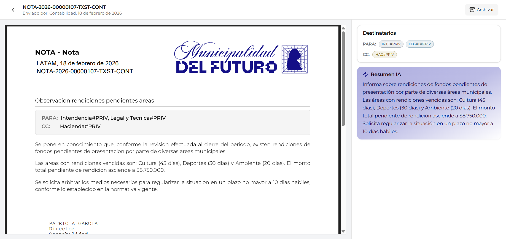

# Nota Recibida

Esta pantalla muestra el detalle de una nota desde la perspectiva del **receptor** (un sector que fue incluido como destinatario). La vista es similar a la de nota enviada, pero con diferencias clave: no incluye la seccion de aperturas y agrega un boton para **archivar** la nota.

---

## Header

En la parte superior de la pantalla se muestra la informacion de identificacion de la nota y el boton de archivo.

| Elemento | Descripcion | Ejemplo |
|----------|-------------|---------|
| **Breadcrumb** | Flecha de retorno (`<`) con el numero oficial de la nota para volver a la bandeja | `< NOTA-2026-00000107-TXST-CONT` |
| **Remitente** | Sector que envio la nota y fecha de envio | *Enviado por: Contabilidad, 18 de febrero de 2026* |
| **Boton Archivar** | Boton en la esquina superior derecha con icono de archivador | `Archivar` |

---

## Diferencias con la nota enviada

| Aspecto | Nota Enviada | Nota Recibida |
|---------|:------------:|:-------------:|
| **PDF con contenido** | Si | Si |
| **Panel Destinatarios** | Si | Si |
| **Panel Aperturas** | Si | No |
| **Panel Resumen IA** | Si | Si |
| **Boton Archivar** | No | Si |

La diferencia principal es que el receptor **no puede ver** quien mas abrio la nota (seccion de aperturas), ya que esa informacion es exclusiva del remitente.

---

## PDF de la nota

El area central muestra el documento PDF con los mismos elementos que en la vista de nota enviada:

| Elemento | Descripcion |
|----------|-------------|
| **Membrete** | Encabezado oficial con el tipo "NOTA - Nota" |
| **Referencia** | Titulo descriptivo de la nota (ej: *Observacion rendiciones pendientes areas*) |
| **Recuadro de destinatarios** | Bloque con los sectores destinatarios en modalidad PARA y CC |
| **Cuerpo** | Contenido completo de la nota |
| **Firma** | Nombre, cargo y sector del firmante (ej: *PATRICIA GARCIA / Director / Contabilidad*) |

---

## Boton Archivar

El boton **"Archivar"** se encuentra en la esquina superior derecha de la pantalla, identificado con un icono de archivador.

| Propiedad | Valor |
|-----------|-------|
| **Ubicacion** | Esquina superior derecha del header |
| **Accion** | Mueve la nota de la pestana "Recibidas" a la pestana "Archivadas" |
| **Reversible** | Si. Desde la pestana "Archivadas" se puede desarchivar la nota |

!!! info "Para que sirve archivar"
    Archivar una nota no la elimina ni la oculta permanentemente. Simplemente la mueve a la pestana **"Archivadas"** de la bandeja de notas para mantener organizada la bandeja de recibidas. La nota sigue siendo accesible en cualquier momento.

---

## Panel lateral

A la derecha del PDF se encuentra el panel lateral con dos secciones.

### Destinatarios

Muestra los sectores a los que fue dirigida la nota, agrupados por modalidad:

| Modalidad | Descripcion | Ejemplo |
|-----------|-------------|---------|
| **PARA** | Sectores destinatarios principales | `INTE#PRIV`, `LEGAL#PRIV` |
| **CC** | Sectores en copia | `HAC#PRIV` |

### Resumen IA

Tarjeta violeta con un resumen automatico del contenido de la nota, generado por inteligencia artificial. Ofrece una vision rapida del contenido sin necesidad de leer el PDF completo.

---

## Preguntas frecuentes

??? question "Puedo saber quien mas recibio esta nota?"
    Si. La seccion de destinatarios en el panel lateral muestra todos los sectores que fueron incluidos como PARA y CC. Los destinatarios en CCO no son visibles.

??? question "Al archivar una nota, se notifica al remitente?"
    No. Archivar es una accion local que solo afecta la organizacion de la bandeja del receptor. El remitente no recibe notificacion.

??? question "Puedo responder a una nota recibida?"
    No directamente desde esta pantalla. Para responder, se debe crear una nueva nota dirigida al sector remitente desde el flujo de creacion de documentos.

??? question "Que pasa si archivo una nota por error?"
    La nota se mueve a la pestana "Archivadas" donde puede ser consultada y desarchivada en cualquier momento.

??? question "El remitente puede ver que abri la nota?"
    Si. Al abrir una nota recibida, la apertura se registra automaticamente y el remitente puede verla en la seccion de aperturas de su vista de nota enviada.
